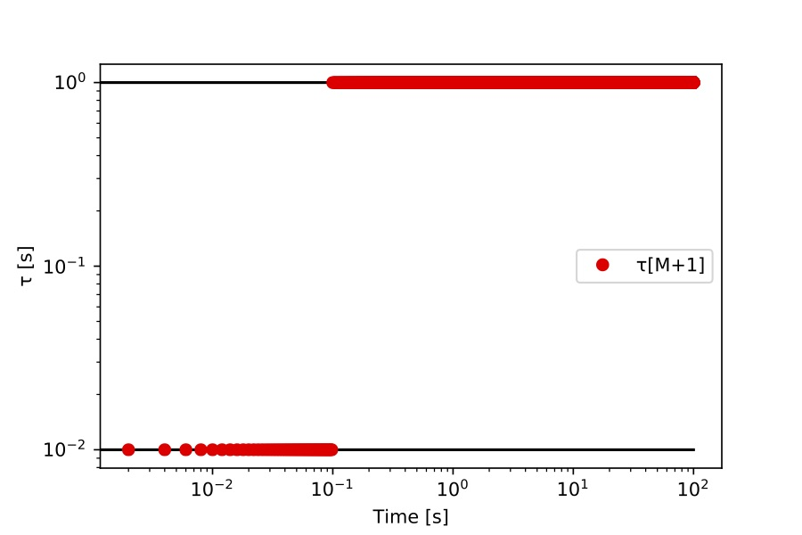
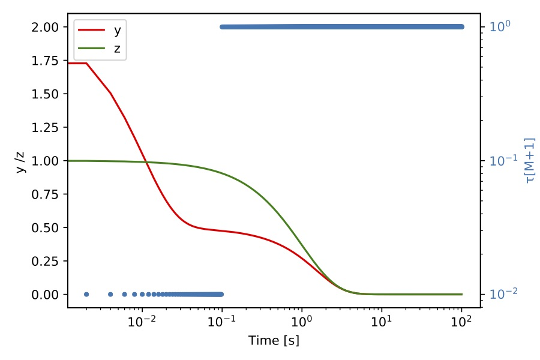
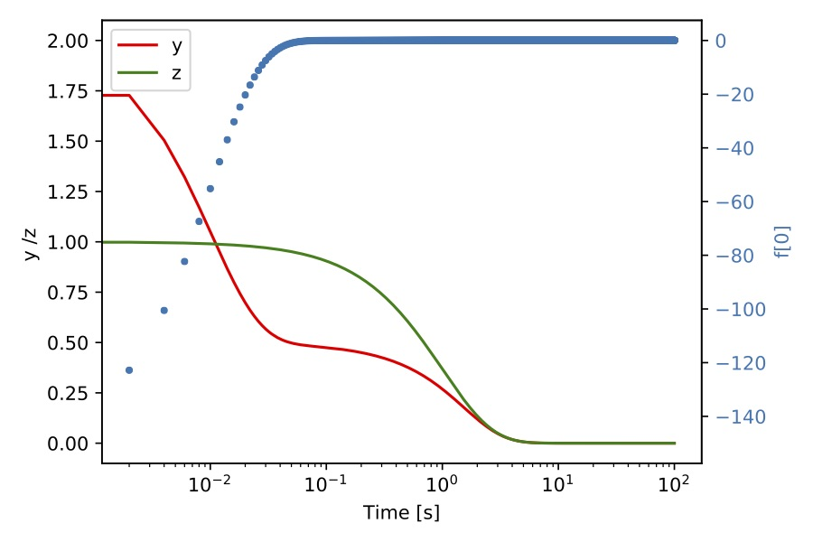

# CSPlib - A Software Toolkit for the Analysis of Dynamical Systems and Chemical Kinetic Models

1\.  [Introduction](#introduction)  
1.1\.  [Citing](#citing)  
1.2\.  [Nomenclature](#nomenclature)  
2\.  [Building CSPlib](#buildingcsplib)  
2.1\.  [Download CSPlib](#downloadcsplib)  
2.2\.  [Configuring CSPlib](#configuringcsplib)  
3\.  [CSP Basic Concepts](#cspbasicconcepts)  
3.1\.  [Formulation](#formulation)  
3.2\.  [CSP Indices](#cspindices)  
3.2.1\.  [CSP Slow Importance Index](#cspslowimportanceindex)  
3.2.2\.  [CSP Fast Importance Index](#cspfastimportanceindex)  
3.2.3\.  [CSP Participation Index](#cspparticipationindex)  
4\.  [Application Programming Interface](#applicationprogramminginterface)  
4.1\.  [Model Class](#modelclass)  
4.1.1\.  [General ODE Class (gODE)](#generalodeclassgode)  
4.1.2\.  [TChem Model Class](#tchemmodelclass)  
4.2\.  [Kernel Class](#kernelclass)  
4.2.1\.  [Eigen Solver With TINES](#eigensolverwithtines)  
4.3\.  [Index Class](#indexclass)  
5\.  [Examples](#examples)  
5.1\.  [CSP Analysis For The Davis Skodje Problem Using The General ODE Class](#cspanalysisforthedavisskodjeproblemusingthegeneralodeclass)  
5.1.1\.  [CSP Analysis Using TINES GPU EigenSolver](#cspanalysisusingtinesgpueigensolver)  
5.2\.  [CSP Analysis For a ODE System Using TChem](#cspanalysisforaodesystemusingtchem)  
5.2.1\.  [GRI 3.0 Results](#gri3.0results)  
5.2.2\.  [CSP Analysis Using the Tines EigenSolver](#cspanalysisusingthetineseigensolver)  
6\.  [Summary](#summary)  
7\.  [Acknowledgement](#acknowledgement)  

<a name="introduction"></a>

## 1\. Introduction

CSPlib is an open source software library for analyzing general ordinary differential equation (ODE) systems and detailed chemical kinetic ODE systems. It relies on the computational singular perturbation (CSP) method for the analysis of these systems. The software provides support for

* General ODE models (gODE model class) for computing source terms and jacobians for a generic ODE system.

* TChem model (ChemElemODETChem model class) for computing source term, Jacobian, other necessary chemical reaction data, as well as the rates of progress for a homogenous batch reactor using an elementary step detailed chemical kinetic reaction mechanism. This class relies on the [TChem](https://github.com/sandialabs/TChem#homogenousbatchreactors)  library.

* A set of functions to compute essential elements of CSP analysis (Kernel class). This includes computations of the eigensolution of the Jacobian matrix, CSP basis vectors and co-vectors, time scales (reciprocals of the magnitudes of the Jacobian eigenvalues), mode amplitudes, CSP pointers, and the number of exhausted modes. This class relies on the Tines library.

* A set of functions to compute the eigensolution of the Jacobian matrix using the Tines library GPU eigensolver.

* A set of functions to compute CSP indices (Index Class). This includes participation indices and both slow and fast importance indices.  

<a name="citing"></a>

### 1.1\. Citing

* Oscar Diaz-Ibarra, Kyungjoo Kim, Cosmin Safta, and Habib Najm, CSPlib - A Software Toolkit for the Analysis of Dynamical Systems and Chemical Kinetic Models, Sandia National Laboratories, SAND 2021-1212, 2021.*

<a name="nomenclature"></a>

### 1.2\. Nomenclature

Symbol|Description
--|--
  |  State vector   
 |  Source vector
 |  Time    
 |  CSP basis vector  
 |  CSP basis co-vector
  |  Mode amplitude  
 |  Jacobian matrix of the ODE right hand side (RHS)  
 |  ODE RHS component in the fast subspace
 |  ODE RHS component in the slow subspace  
 |  Number of fast exhausted modes  
 |  Error for variable   
 |  Relative error tolerance   
 |  Absolute error tolerance  
 |  Time scale    
 |  Eigenvalues of Jacobian matrix  
 |  Number of species  
 |  Number of reactions  
 | Number of variables
 | S matrix
 |  Rate of progress or reaction 
 RoP | Rate of progess
 CSPpointer |  CSP pointer for mode  with respect to variable 
|  Slow importance index of reaction  for variable   
 | Fast importance index of reaction  for variable   
 | Participation index of reaction  for mode 
<a name="buildingcsplib"></a>

## 2\. Building CSPlib

CSPlib requires Tines and Kokkos for the computation of the eigendecomposition on GPU or CPU hardware, and for linear algebra operations. Additionally, CSPlib has an interface to [TChem](https://github.com/sandialabs/TChem).

For convenience, we explain how to build the CSPlib code using the following environment variables that one can modify according to their working environments.

```bash
/// repositories
export CSP_REPOSITORY_PATH=/where/you/clone/csp/git/repo

/// build directories
export CSP_BUILD_PATH=/where/you/build/csp

/// install directories
export TCHEM_INSTALL_PATH=/where/you/install/tchem
export KOKKOS_INSTALL_PATH=/where/you/install/kokkos
export TINES_INSTALL_PATH=/where/you/install/tines

/// Tines requires OpenBlass
export LIBRARY_PATH=${LIBRARY_PATH}:=/where/you/install/OpenBlas/lib
```

<a name="downloadcsplib"></a>

### 2.1\. Download CSPlib
Clone the CSPlib repository. Instructions on how to download and install TChem, kokkos and Tines are found in the [TChem repository](https://github.com/sandialabs/TChem).

```bash
  git clone https://github.com/sandialabs/CSPlib ${CSP_REPOSITORY_PATH};
```

<a name="configuringcsplib"></a>

### 2.2\. Configuring CSPlib

The following example cmake script compiles CSPlib on the host, linking with Tines.

```bash
cmake \
    -D CMAKE_INSTALL_PREFIX=${CSP_INSTALL_PATH} \
    -D CMAKE_CXX_COMPILER="${my_cxx}" \
    -D CMAKE_C_COMPILER="${my_cc}" \
    -D KOKKOS_INSTALL_PATH=${KOKKOS_INSTALL_PATH} \
    -D TINES_INSTALL_PATH=${TINES_INSTALL_PATH} \
    ${CSP_REPOSITORY_PATH}/src
```

The following cmake example compiles CSPlib with TChem. CSPlib uses TChem to compute source terms, the Jacobian of the source term and the  matrix and the rate of progress. TChem requires [Kokkos github pages](https://github.com/kokkos/kokkos) and Tines. Therefore, these libraries must also be installed.   

```bash
cmake \

    -D CMAKE_INSTALL_PREFIX=${CSP_INSTALL_PATH} \
    -D CMAKE_CXX_COMPILER="${my_cxx}" \
    -D CMAKE_C_COMPILER="${my_cc}" \
    -D OPENBLAS_INSTALL_PATH=${OPENBLAS_INSTALL_PATH}  \
    -D CSP_ENABLE_TCHEMPP=ON \
    -D TCHEM_INSTALL_PATH=${TCHEM_INSTALL_PATH}\
    -D KOKKOS_INSTALL_PATH=${KOKKOS_INSTALL_PATH} \
    -D TINES_INSTALL_PATH=${TINES_INSTALL_PATH} \
    ${CSP_REPOSITORY_PATH}/src
make install   
```

TChem is designed and implemented using Kokkos (a performance portable parallel programming model), thus, CSPlib can also carry out computation on a GPU. For GPUs, we can use the above cmake script  and replace the compiler choice by adding ``-D CMAKE_CXX_COMPILER="${KOKKOS_INSTALL_PATH}/bin/nvcc_wrapper"``.
<a name="cspbasicconcepts"></a>

## 3\. CSP Basic Concepts
<a name="formulation"></a>

### 3.1\. Formulation
Consider the autonomous ODE system in :  

<p align="center"></p>

With the initial value  .

Where  is a vector of state variables. For example, for a chemical kinetic model in a homogeneous gas phase constant pressure system, this can be comprised of the gas temperature and the mass fractions for the gas species. The right hand side (RHS)  vector is a function of the state vector .

CSP analysis is primarily useful in the context of stiff dynamical systems exhibiting a wide range of fast/slow time scales. The goal of the analysis is to decouple fast and slow processes, thereby enabling specific dynamical diagnostic capabilities, by rewriting the system RHS using a suitable set of basis vectors [Lam 1993](https://www.tandfonline.com/doi/abs/10.1080/00102209308924120). CSP analysis seeks a set of basis vectors , , that linearly expand [Lam 1993](https://www.tandfonline.com/doi/abs/10.1080/00102209308924120):

<p align="center"></p>

where  is the (signed) "amplitude" of  as projected on the basis vector ,
<p align="center"></p>

where the  vectors are, by construction, orthonormal to the  vectors.

<p align="center"></p>

Given the  CSP basis vectors, the associated co-vectors  are computed using the orthonormality constraint (Eq. 3), and mode amplitudes  (Eq. 2). CSP provides a refinement procedure to construct the basis vectors  [Lam 1993](https://www.tandfonline.com/doi/abs/10.1080/00102209308924120), [Valorani 2001](https://www.sciencedirect.com/science/article/pii/S0021999101967099). Alternatively, the right eigenvectors of the jacobian  provide a first order approximation of the ideal CSP  basis vectors. For a linear ODE system, the eigensolution perfectly decouples the fast and the slow time scales of . For a nonlinear system it provides only approximate decoupling. This library uses the Jacobian eigenvectors as the CSP basis vectors. Given that we are dealing with real, generally non-symmetric, Jacobian matrices, we can expect that any complex eigenvalues will be complex conjugate pairs, and similarly for the associated eigenvectors. When a pair of modes are complex conjugates, we do not use the complex eigenvectors as CSP basis vectors, rather we use two real eigenvectors that span the same plane. Thus we always have real CSP basis vectors.


We order the eigenmodes in terms of decreasing eigenvalue magnitude , Thus in order of decreasing time scales ,
<p align="center"></p>
so that mode 1 is the fastest mode, mode 2 is the next slower mode, etc.

Typically, chemical kinetic ODE models exhibit a number of fast decaying eigenmodes, associated with eigenvalues having large magnitudes (small timescales) with negative real components. These modes exhibit fast decay towards a slow invariant manifold developed from the equilibration of fast exhausted processes. Typical dynamics in systems that evolve towards an equilibrium involve a gradual increase in the number of fast exhausted modes, as successive time scales are exhausted, and the system approach the equilibrium point.  

At any point in time, presuming  fast exhausted modes, we split  into slow and fast components:

<p align="center"></p>

Thus,  defines the dimension of the fast subspace. It is computed as the maximum  for which

<p align="center"></p>

Where . Note that  is critical to calculate . We estimate  with employing absolute and relative tolerances,

<p align="center"></p>

In equation [5],  is the time scale, and  is an eigenvalue.

With the CSP basis vectors we can also compute the CSP pointers. The CSP pointers identify the degree of orthogonality between the dimension of each species in the configuration space and the equation of state constraint developed out of the exhaustion of each of the fast modes [Lam 1993](https://www.tandfonline.com/doi/abs/10.1080/00102209308924120). The pointer for mode  and species  is defined as:
<p align="center"></p>

The equations presented above outline the basics of CSP. Detailed mathematical derivations and description of the method are presented in [Lam 1985](https://link.springer.com/chapter/10.1007/978-1-4684-4298-4_1), [Lam 1989](https://www.sciencedirect.com/science/article/pii/S008207848980102X), [Lam 1991](https://link.springer.com/chapter/10.1007/BFb0035372), [Lam 1993](https://www.tandfonline.com/doi/abs/10.1080/00102209308924120). Application of CSP in combustion and other fields are presented in [Trevino  1988](https://www.sciencedirect.com/science/article/pii/S0082078406800196) [Goussis  1992](https://www.sciencedirect.com/science/article/pii/S0082078406800184) [Goussis 1995](https://www.sciencedirect.com/science/article/pii/S0021999196902090) [Ardema 1989](https://www.sciencedirect.com/science/article/pii/S1474667017519503) [Rao 1994](https://arc.aiaa.org/doi/abs/10.2514/6.1995-3262) [Goussis](https://arc.aiaa.org/doi/10.2514/6.1990-644) [Valorani 2001](https://www.sciencedirect.com/science/article/pii/S0021999101967099) [Valorani 2003](https://www.sciencedirect.com/science/article/pii/S0010218003000671) [Valorani 2005](https://www.sciencedirect.com/science/article/pii/S0021999105001981) [Valorani 2006](https://www.sciencedirect.com/science/article/pii/S0010218006001180) [Valorani 2015](https://www.sciencedirect.com/science/article/pii/S0010218015001534) [Malpica 2017](https://www.sciencedirect.com/science/article/pii/S0010218017300652) [Prager 2011](https://www.sciencedirect.com/science/article/pii/S0010218011001039) [Gupta 2013](https://www.sciencedirect.com/science/article/pii/S1540748912003690).  


<a name="cspindices"></a>

### 3.2\. CSP Indices
The following definitions for CSP indices are relevant for an elementary reaction based chemical kinetic mechanism, involving  species and  reactions. The model is presumed to involve  state variables, being the temperature , and the mass fractions of the species.

We start by writing the RHS  as the product of the  matrix , which is the generalized stoichiometric matrix, and the vector , where  is the rate of progress for elementary reaction . By construction, we treat each reaction as reversible, thus we have  reactions. In this context, an irreversible reaction is assigned a zero-rate in the opposite direction. Thus, we write  as

<p align="center"></p>

where  is the -th column of .

The  matrix is defined by , where   is the  matrix of stoichiometric coefficients. For a constant pressure, homogeneous batch reactor, the  matrix  is defined by:

<p align="center"></p>
where  is density and  is specific heat at constant pressure of the gas mixture,  is the enthalpy of species , and  is the molar mass of species .

The rate of progress is defined by . Where  and  are the forward and reverse rates of progress of reaction .  


With the definition of the amplitude of the  mode .  

<p align="center"></p>

<p align="center"></p>

<a name="cspslowimportanceindex"></a>

#### 3.2.1\. CSP Slow Importance Index

The csp representation of the source term in the slow subspace is given by
<p align="center"></p>
where
<p align="center"></p>
and . The slow importance index of reaction  with respect to state variable  is defined as:
<p align="center"></p>

<a name="cspfastimportanceindex"></a>

#### 3.2.2\. CSP Fast Importance Index

The csp representation of the source term in the fast subspace is given by
<p align="center"></p>
where
<p align="center"></p>
with . The fast importance index of reaction  with respect to state variable  is defined as:
<p align="center"></p>

<a name="cspparticipationindex"></a>

#### 3.2.3\. CSP Participation Index

The Participation Index of the  reaction in the  mode is defined as

<p align="center"></p>
<a name="applicationprogramminginterface"></a>

## 4\. Application Programming Interface

A typical CSPlib analysis involves the following steps:

***Model class or interface***
1.1 Compute : source terms or RHS.

1.2 Compute : Jacobian of RHS.
1.3 Compute : Rate of progress.
1.4 Compute : S matrix.

***Kernel class***
2.1 Compute : Eigenvalues and eigenvectors.
2.2 Sort    : Eigenvalues and eigenvaluesvectors.
2.3 Set     : Matrix whose columns are the CSP basis vectors (right eigenvectors of Jacobian), and its inverse matrix.
2.4 Compute : Amplitudes of modes.  
2.5 Compute : Time scales.
2.6 Compute : Number of exhausted modes.
2.7 Compute : Compute CSP pointers.

***Index class***
3.1 Compute : Participation indices.
3.2 Compute : Slow Importance indices.
3.3 Compute : Fast Importance indices.

<a name="modelclass"></a>

### 4.1\. Model Class

The model class is responsible for computing the source term (RHS) of the system and its Jacobian matrix. Additionally, if we have a chemical kinetic model, the model class will compute the S matrix and the reaction rates of progress. We have two available model classes, the general ODE class (gODE), and the TChem model class.  

<a name="generalodeclassgode"></a>

#### 4.1.1\. General ODE Class (gODE)

The general ode class (``CSP_REPOSITORY_PATH/src/core/gODE.cpp``) can handle any ODE system. This class requires a function for RHS and the Jacobian matrix.  

For example for the Davis-Skodje problem [Davis-Skodje 1999](https://aip.scitation.org/doi/10.1063/1.479372), [Valorani 2005](https://www.sciencedirect.com/science/article/pii/S0021999105001981). The RHS and jacobinan functions are:

```cpp
int rhs_Davis_Skodje(const std::vector<double>& state, std::vector<double>& source){
    const double epsilon = 0.01;
    const double y = state[0];
    const double z = state[1];
    source[0] = (-y+z/(1.+z))/epsilon - z/(1.+z)/(1.+z);
    source[1] = -z;
  return(0);
}

int jac_Davis_Skodje(const std::vector<double>& state, std::vector<std::vector<double>>& jac, int flag){
  const double epsilon = 0.01;
  const double y = state[0];
  const double z = state[1];

  jac[0][0] = -1./epsilon;
  jac[1][0] = 0;
  jac[0][1] = 2. * z / std::pow( z + 1. , 3.) - 1. / std::pow( z + 1., 2) +
              ( - z / std::pow( z + 1. , 2.) + 1. / ( z + 1. ) ) / epsilon;
  jac[1][1] = -1;
  return(0);
}
```
We pass these two functions to the gODE class .

```cpp
/// Constructor takes two functions.
GeneralODE mDavis_Skodje(
  std::function<int(const std::vector<double>&, std::vector<double>&)> (std::move(rhs_Davis_Skodje)),
  std::function<int(const std::vector<double>&, std::vector<std::vector<double>>&, int)> (std::move(jac_Davis_Skodje))
);
```  
To evaluate the RHS and Jacobian we do the following:

```cpp
//set state vector
mDavis_Skodje.setStateVector(state);
//eval rhs
mDavis_Skodje.evalSourceVector();
//get g
mDavis_Skodje.getSourceVector(source);
//eval Jacobian
mDavis_Skodje.evalJacMatrix(flag);
// get Jacobian
mDavis_Skodje.getJacMatrix(jac);
```

<a name="tchemmodelclass"></a>

#### 4.1.2\. TChem Model Class
The TChem model class (``CSP_REPOSITORY_PATH/src/core/chem_elem_ODE_TChem.cpp``) computes the source term, the Jacobian matrix, the rate of progress, and the S matrix for an elementary step chemical kinetic reaction mechanism. This class is a collection of function calls to TChem. TChem is designed and implemented with the Kokkos library. Thus, these computations can be performed in CPUs: (``Kokkos::DefaultHostExecutionSpace``) or in GPUs:  (``Kokkos::DefaultExecutionSpace``).The default execution space is configured as OpenMP or Cuda upon its availability. The default host execution spaces is always configured as OpenMP.  Besides, this class performs the computation in a batched mode.  


To create an instance of this class, we use:
```cpp
/// Constructor takes two input files.
///   [in] mech_gas_file - Chemkin reaction mechanism file
///   [in] thermo_gas_file - Thermo file
ChemElemODETChem( const std::string &mech_gas_file     ,
                  const std::string &thermo_gas_file   )                
```

The Chemkin-input files contain all the parameters of the reaction mechanism.

We can use the TChem model class to read an entire solution from the TChem homogenous batch reactors. This reactor resolves gas temperature and mass fraction in a transient batch reactor.

```cpp
//
///   [in] filename - database filename
///   [out] varnames - vector with variable names from TChem solution
 ChemElemODETChem::readIgnitionZeroDDataBaseFromFile(const std::string &filename,
                            std::vector<std::string> &varnames) ;
```

If we choose to run the computation on the device (GPU), the ``readIgnitionZeroDDataBaseFromFile`` function will copy and move the data to the GPUs. Alternatively, if we want to run the computation on the host space (CPU), we use the function call ``model.run_on_host(true)``.

```cpp
[in] run_on_host: true-run on host space , false -run on execution space
ChemElemODETChem::run_on_host(const bool & run_on_host)
```

If we do not have a TChem's database, we need to pass our database to the model class with the following function.

```cpp
/// [in] state_db: database for CSP analysis
ChemElemODETChem::setStateVectorDB(std::vector<std::vector <double> >& state_db)
```
The database is a 2D std::vector where the rows are the solution for each time. The columns correspond to the "time or iteration, density [kg/m], pressure [Pascal], Temperature[K], mass fractions".

With the uploaded database, the following function calls compute the source therms, the Jacobian matrix, the S matrix, and the rate of progress.

```cpp
ChemElemODETChem::evalSourceVector();
/// [in] useNumJac: 0 use analytical Jacobian, 1 use numerical jacabian
ChemElemODETChem::evalJacMatrix(unsigned int useJacAnl);
ChemElemODETChem::evalSmatrix();
ChemElemODETChem::evalRoP();
```

The TChem model class copies the computed data to the host space.  To obtain the data from this class, we use the following functions:

```cpp
/// [out] state_db :  state vector for the whole database  
ChemElemODETChem::getStateVector(std::vector<std::vector <double> >& state_db);

/// [out] source_db: source vector for the whole database
ChemElemODETChem::getSourceVector(std::vector<std::vector <double> >& source_db);

// [out] jac_db : Jacobian matrix for the whole database
ChemElemODETChem::getJacMatrix(std::vector <std::vector
                    <std::vector <double> > >& jac_db);

// [out] RoP: rate of progress for the whole database
ChemElemODETChem::getRoP(std::vector<std::vector <double> >& RoP);

// [out] Smatrixdb: S matrix for whole database
ChemElemODETChem::getSmatrix(std::vector < std::vector
                        <std::vector <double> > >& Smatrixdb);

```

The state and source vectors have a size of , involving temperature and mass fractions, the size of the Jacobian matrix is , the size of S matrix and rate of progress vector is  and  respectively. The rate of progress vector includes the forward and reverse rate of progress.  

This class has additional functions to help post-process the CSP data.

```cpp
/// [out] return the number of species  
ChemElemODETChem::NumOfSpecies()
/// [out] return the number of reactions
ChemElemODETChem::NumOfReactions()
/// [out] spec_name: name of species in the reaction mechanism
ChemElemODETChem::getSpeciesNames(std::vector<std::string>& spec_name)
/// [in] var_name: variable name, use "Temperature" for temperature
///[out] return index of the variable in the csp analysis.
ChemElemODETChem::getVarIndex(const std::string & var_name)
/// [out] return number of variables in the csp analysis
ChemElemODETChem::getNumOfVariables()
/// [out] return  number of elements
ChemElemODETChem::getNumOfElements()
```

<a name="kernelclass"></a>

### 4.2\. Kernel Class

The second group of steps are implemented in the kernel class (``CSP_REPOSITORY_PATH/src/core/kernel.cpp``). This class computes the eigendecomposition for the Jacobian matrix, the time scales  , the number of exhausted model (), the  and  CSP basis vectors, the amplitude of the modes  and the CSP pointers.

We initialize this class with the number of variables, the g (source) vector and the Jacobian matrix(jac).  

```cpp
/// Constructor takes four inputs.
///   [in] nvars - number of state variable
///   [in] state_vec - y vector of state vector
///   [in] source_vec - g vector or rhs vector
///   [in] Jmat - Jacobian matrix of g
Kernel(int nvars,
       std::vector<double> &state_vec,
       std::vector<double> &source_vec,
       std::vector< std::vector<double> > &Jmat
      )
```
This class calculates the eigendecomposition of the Jacobian matrix. Next, It sorts the eigenvalues in descending order with respect to their magnitudes. With the sorted eigenvalues and eigenvectors, it sets the right eigenvectors as the  CSP basis vectors, and form the matrix  whose columns are the  vectors. The matrix , whose rows are the  vectors, is the inverse of  (see equation~\ref{eq:b}). The matrix inversion is done by Tines.


```cpp
/// Computation of eigendecomposition
/// This function does not have inputs. The jacobian matrix is a private member of the class.
Kernel::evalEigenValVec();

// sort eigenvalues in descending order, we use new order to sort eigenvectors as well.
Kernel::sortEigValVec();

//Set CSP basis vectors.
Kernel::setCSPVec(); // A = eig_vec_R and B = A^{-1}
//get CSP basis vector csp_vec_R(a) csp_vec_L(b).
Kernel::getCSPVec(csp_vec_L, csp_vec_R);
```

The time scales are computed as , where  is the magnitude of the eigenvalues. The amplitude of the mode  is computed with [equation [2]](#cspbasicconcepts).

```cpp
// compute time scale.
Kernel::evalTau();
/// [out]  tauvec - time scales
Kernel::getTau(std::vector<double> &tauvec);
// compute the magnitude of the modes.
Kernel::evalModalAmp( );
/// [out] fvec - magnitud of the modes
Kernel::getModalAmp(std::vector<double> &fvec );
```

The number of exhausted modes  is computed using relative and absolute tolerances (see [equation [5]](#cspbasicconcepts)) and a state vector. The tolerances are inputs of the analysis. The value of  cannot be bigger than , or the number of eigenvalues with negative real component.

```cpp
/// [in] csp_rtolvar - relative tolerance for CSP analysis.
/// [in] csp_atolvar - absolute tolerance for CSP analysis.
Kernel::setCSPerr(double csp_rtolvar, double csp_atolvar);
/// [in] nel- number of elements in the reaction mechanism or system  
Kernel::evalM(const int &nElem);
/// [out] Number of exhausted M.
Kernel::getM(int &NofDM);
```

The CSP pointers ([equation [7]](#cspindices)) for all modes is computed by:
```cpp
Kernel::evalCSPPointers();
```
To obtain the CSP pointer data from the kernel class we use:
```cpp
/// [out] cspp_ij - csp pointers; row
Kernel::getCSPPointers( std::vector<std::vector<double>> &cspp_ij );
```
We can also use the function :
```cpp
/// [in] modeIndx - mode element position
/// [out] cspp_k - CSP pointer position for mode with element position modeIndx
Kernel::evalAndGetCSPPointers(const int & modeIndx, std::vector<double> &cspp_k)
```
To compute the CSP pointers for one mode.

At this point, the kernel class has computed all CSP data for a basic ODE system. Among these data, the time scales (), the amplitude of the modes (), the CSP basis vectors  and , the eigenvalues and eigenvectors of the system, the number of exhausted modes , and the CSP pointers.

Additionally, the kernel class has diagnostic tools to test if the CSP data is not corrupted by numerical error.

The numerical rank of the Jacobian is used to check how many of the eigenvalues are reliably computed. The number of valid eigenvalues is equal to the numerical rank. Thus, if a Jacobian is not full rank, the smallest eigenvalues are essentially numerical noise.

```cpp
///[out] return the numerical rank of the Jacobian matrix
Kernel::computeJacobianNumericalRank()
```

We check the eigensolution only for the valid eigenvalues, according to the numerical rank of the Jacobian.

```cpp
//If a residual bigger than 1e-6 is obtained. " ---- High residual --- " will print out.
Kernel::DiagEigValVec();
```
We also check the orthonormality condition for the CSP basis vector.  

```cpp
// If a residual bigger than 1e-10 is obtained.
//": --- Orthogonality test failed: .." will print out.
Kernel::DiagOrthogonalityCSPVec();
```


<a name="eigensolverwithtines"></a>

#### 4.2.1\. Eigen Solver With TINES

CSPlib has four different interfaces to Tines' eigensolver depending on the execution spaces and the input type. The first interface performs the eigensolution on the GPUs (CUDA, device execution space), and the inputs are in Kokkos-view format allocated in the GPUs memory space. The second interface carries out the computation on the CPUs (OPENMP, host execution spaces) and the inputs also in Kokkos-view format. The third interface uses the GPUs with the inputs in 3D std::vector format. Finally, in the fourth interface, the computation is performed in CPUs, and the inputs are in 3D std::vector format.  

The input of these interfaces is a database of Jacobians. The outputs are the real and imaginary part of the eigenvalues and the right eigenvectors for the whole database in 3D std vectors format.  

The function to call the GPU's interface with Kokkos-view type is the following:
```cpp
///   [in] jac - database of Jacobians - data is allocated  on the device
///   [out] eig_val_real_bath - real part eigenvalues of database
///   [out] eig_val_imag - imaginary part eigenvalues of database
///   [out] eig_vec_R - right eigenvectors of database
EigenSolver::evalDevice(const value_type_3d_view& jac,
                        std::vector<std::vector <value_type> >& eig_val_real,
                        std::vector<std::vector <value_type> >& eig_val_imag,
                        std::vector < std::vector<std::vector <value_type> > >& eig_vec_R);
```

The function to call the CPU's interface with Kokkos-view:

```cpp
///   [in] jac - database of Jacobians - data exists on the host
///   [out] eig_val_real_bath - real part eigenvalues of database
///   [in] eig_val_imag - imaginary part eigenvalues of database
///   [in] eig_vec_R - right eigenvectors of database
EigenSolver::evalHost(const value_type_3d_view_host& jac,
                        std::vector<std::vector <value_type> >& eig_val_real,
                        std::vector<std::vector <value_type> >& eig_val_imag,
                        std::vector < std::vector<std::vector <value_type> > >& eig_vec_R);
```

The function to call the GPU's interface with 3D std::vectors:

```cpp
///   [in] jac - database of Jacobians
///   [out] eig_val_real_bath - real part eigenvalues of database
///   [out] eig_val_imag - imaginary part eigenvalues of database
///   [out] eig_vec_R - right eigenvectors of database
EigenSolver::evalDevice(const std::vector < std::vector<std::vector <value_type> > >& jac,
                        std::vector<std::vector <value_type> >& eig_val_real,
                        std::vector<std::vector <value_type> >& eig_val_imag,
                        std::vector < std::vector<std::vector <value_type> > >& eig_vec_R);
```

The function to call the CPU's interface with 3D std::vectors:

```cpp
///   [in] jac - database of Jacobians - data exists on the host
///   [out] eig_val_real_bath - real part eigenvalues of database
///   [in] eig_val_imag - imaginary part eigenvalues of database
///   [in] eig_vec_R - right eigenvectors of database
EigenSolver::evalHost(const std::vector < std::vector<std::vector <value_type> > >& jac,
                      std::vector<std::vector <value_type> >& eig_val_real,
                      std::vector<std::vector <value_type> >& eig_val_imag,
                      std::vector < std::vector<std::vector <value_type> > >& eig_vec_R);
```

<a name="indexclass"></a>

### 4.3\. Index Class
To instantiate the index class, we need nine inputs from the model and kernel classes.

```cpp
/// Constructor takes eight inputs.
///   [in] Nreac - number of reactions
///   [in] Nvar - number of variables
///   [in]  M - number of exhausted modes
///   [in] eig_val_real - eigenvalues real part
///   [in] eig_val_imag - eigenvalues imaginary part
///   [in] A - a csp basis vector
///   [in] B - b csp basis vector
///   [in] Smat - S matrix
///   [in] RoP  - rate of progress
CSPIndex(
      int Nreac,
      int Nvar,
      int M,
      std::vector<double> &eig_val_real,
      std::vector<double> &eig_val_imag,
      std::vector<std::vector<double> > &A,
      std::vector<std::vector<double> > &B,
      std::vector<std::vector<double> > &Smat,
      std::vector<double> &RoP
     )
```

The following functions compute the Participation indices ([equation [11]](#cspindices)), and the slow and fast Importance indices ([equations [9] and [10]](#cspindices)) for all variables and modes for one state vector.   

```cpp
CSPIndex::evalParticipationIndex();
CSPIndex::evalImportanceIndexSlow();
CSPIndex::evalImportanceIndexFast();
```
To obtain the data produced by the above function:
```cpp
/// [out] P_ik - Participation index; rows: modes, columns: rate of progress
CSPIndex::getParticipationIndex (std::vector<std::vector<double> > &P_ik  );
/// [out] Islow_jk - Slow importance index; rows: variable, columns: rate of progress
CSPIndex::getImportanceIndexSlow( std::vector<std::vector<double> > &Islow_jk );
/// [out] Ifast_jk- Fast importance index;  rows: variables, columns: rate of progress
CSPIndex::getImportanceIndexFast(std::vector<std::vector<double> > &Ifast_jk );
```

Sometimes, one only wants to compute the index for a few modes/variables. In this case, one can use the following functions:

```cpp
/// [in] modeIndx - index (position) for mode
/// [out] P_k - Participation index for mode with indx modeIndx
CSPIndex::evalAndGetParticipationIndex(const int &modeIndx, std::vector<double> &P_k);
/// [in] varIndx - index (position) for variable
/// [out] Islow_k - Slow importance index for variable with index varIndx
CSPIndex::evalAndGetImportanceIndexSlow(const int & varIndx, std::vector<double> &Islow_k);
/// [in] varIndx - index (position) for variable
/// [out] Ifast_k -  Fast importance index for variable with index varIndx
CSPIndex::evalAndGetImportanceIndexFast(const int & varIndx, std::vector<double> &Ifast_k);
```

The ``CSPIndex::getTopIndex`` function returns an std::vector<int> with the reaction number (in the rate of progress vector) for the highest absolute value Participation and slow/fast Importance indices.

```cpp
/// [in] Index - Participation/slow/fast index for one mode or variable
/// [in] Top - only add top absolute values.
/// [in] threshold- only add values bigger than this threshold value.
/// [in/out] IndxList- list of reaction number in the RoP(rate of progress) vector.
CSPIndex::getTopIndex(std::vector<double> &Index,
                const int & Top, const double & threshold,
                std::vector<int> & IndxList );
```
For example, to find out which reactions have the highest contribution in the fastest mode, one can use this function and pass the participation index for mode 0. This participation index (std::vector) is obtained with the function ``CSPIndex::evalAndGetParticipationIndex``  with ``modeIndx=0``. Alternatively, one can use the ``CSPIndex::evalParticipationIndex`` function, and get the Participation indices for all modes with ``CSPIndex::getParticipationIndex``. The output of the function ``CSPIndex::getTopIndex`` is ``IndxList``, which is a vector containing  the reaction number in the rate of progress vector.

<a name="examples"></a>

## 5\. Examples
<a name="cspanalysisforthedavisskodjeproblemusingthegeneralodeclass"></a>

### 5.1\. CSP Analysis For The Davis Skodje Problem Using The General ODE Class

We use the gODE class (``CSP_REPOSITORY_PATH/src/core/gODE.cpp``) to analyze the Davis-Skodje (DS) problem [Davis-Skodje 1999](https://aip.scitation.org/doi/10.1063/1.479372), [Valorani 2005](https://www.sciencedirect.com/science/article/pii/S0021999105001981) to illustrate the utility of CSPlib in analyzing stiff ODE systems.

This is a two dimensional ODE system,

<p align="center"></p>

<p align="center"></p>

With the initial condition , . Where the  parameter is constant and much smaller than one. In this system,  is the slow variable and  is the fast variable. The analytical solution of this problem is:

<p align="center"></p>

<p align="center"></p>

The example code for this problem is in ``CSP_REPOSITORY_PATH/src/example/gODE/driver_gODE_Davis_Skodje.cpp``.

Usage information is available:  

```bash
./driver_gODE_Davis_Skodje --help
Usage: ./driver_gODE_Davis_Skodje [options]
  options:
  --atol                        double    absolute tolerance for csp analysis e.g., 1e-8
                                          (default: --atol=1.0e-14)
  --echo-command-line           bool      Echo the command-line but continue as normal
  --help                        bool      Print this help message
  --nPoints                     int       number of points  e.g., 2000
                                          (default: --nPoints=2000)
  --rtol                        double    relative tolerance for csp analysis e.g., 1e-2
                                          (default: --rtol=1.0e-03)
  --tend                        double    time end e.g., 4
                                          (default: --tend=4.0e+00)
  --y0                          double    initial value for y e.g., 2
                                          (default: --y0=2.0)
  --z0                          double    initial value for y e.g., 1e-2
                                          (default: --z0=1.0e-02)
Description:
  This example Number of exhausted and time scale for mDavis Skodje problem
```

The following bash script runs a CSP analysis for the DS problem:

```bash
exec=$CSP_INSTALL_PATH/example/kernel_class/driver_gODE_Davis_Skodje
rtol=1e-4
atol=1e-14
y0=2.
z0=1.
tend=15.
nPoints=10000
$exec --tend=$tend --y0=$y0 --nPoints=$nPoints --z0=$z0 --rtol=$rtol --atol=$atol
```
 The above script and a jupyter-notebook with the below figures is located at ``CSP_INSTALL_PATH/example/runs/Davis_Skodje``.


 The inputs from the script are:
  * the executable for this example ("driver\_gODE\_Davis\_Skodje"),
  * the relative and absolute tolerances for csp analysis ("rtol" and "atol"),
  * the initial condition for the problem "y0" and "z0",
  * the final time "tend" and the number of points that we want to produce for the analysis "nPoints".


The example has the following structure:

 ```cpp
 //set the GeneralODE with the mDavis_Skodje rhs and jacobian

 // make a list of file to save data

//for example
 std::string mNew_file_name = firstname + "_m.dat";
 FILE *fout = fopen ( (mNew_file_name).c_str(), "w" );


 // make a for loop over the nPoints

 for (int sp = 0; sp < nPoints; sp++) {

  // set state vector: from analytical solution

  // compute source terms and Jacobian

  // make an instance of the kernel class

  // compute eigenvalues and eigenvectors

  // set CSP basis vector

  // sort eigenvalues and eigenvectors

  // compute time scales

  // compute modal amplitude

  // compute M

 }  

 fclose(fout)
 ```
We save data for each time iteration (nPoints), the data correspond to: the number of exhausted modes  ``_m.dat`` (nPoints), the time scales ( nPoints ) ``_tau.dat``, the numerical rank of the Jacobian ( nPoints) ``_jac_numerical_rank.dat``, the amplitude of the modes ``_magMode.dat`` (nPoints), the state vector ``_state.dat`` (nPoints ) and time (``_time.dat``).  With these data we produce the following figures:


Figure 1. A plot of time scales versus time. Red dots correspond to , the time scale of the fastest active mode.


Figure 2. A plot of  (left axis) and  (right axis) versus time for the DS problem.   


Figure 3.  A plot of  (left axis) and  (right axis) versus time for the DS problem.


Figure 4. A plot of  (left axis) and  (right axis) versus time for the DS problem.


Figure 5. A plot of  (left axis) and  (right axis) versus time for the DS problem.

The CSP analysis reveals characteristics of the DS problem that could not identify from its source term equation. The analysis shows a fast and a slow time scale (see Figure1 ), where the slow time scale is  s, and the fast time scale is  s. From Figure 2, we can notice that between time  s to  s, there are zero exhausted modes (). In this time interval,  is equal to the slow time scale (Figure 1), which means the process advance at the slow time scale because all processes are active.  Between   s and  s,  changes to 1, in this time interval  also changes to the fast time scale. At the end of this period, both curves become constant,  is 2, denoting that the system is in equilibrium. Similarly, the mode amplitude curves in the Figures 4 and 5 display the behavior describe above. The mode amplitude  reaches equilibrium at   s and the mode amplitude  reaches equilibrium at  s .

<a name="cspanalysisusingtinesgpueigensolver"></a>

#### 5.1.1\. CSP Analysis Using TINES GPU EigenSolver

The computation of the eigenvalues and eigenvectors is one of the most computational expensive parts of the CSP analysis. Thus, CSPlib offers an interface for the [Tines GPU eigensolver](#eigensolverwithtines). We use this interface to compute the eigensolution for DS problem.  The example code is in: ``CSP_REPOSITORY_PATH/src/example/gODE/driver_gODE_Davis_Skodje_K.cpp``.

The structure of this example with Tines' eigensolver is:  

```cpp
CSP::ScopeGuard guard(argc, argv);

//set the GeneralODE with the mDavis_Skodje rhs and Jacobian

// make a list of file to save data

//for example
std::string mNew_file_name = firstname + "_m.dat";
FILE *fout = fopen ( (mNew_file_name).c_str(), "w" );


// make a for loop over the nPoints

for (int sp = 0; sp < nPoints; sp++) {

 // set state vector: from analytical solution

 // compute source terms and Jacobian

}

 // compute eigenvalues and eigenvectors using the TINES GPU EigenSolver

 EigenSolver::evalDevice(jac_db,
                         eig_val_real_bath,
                         eig_val_imag_bath,
                         eig_vec_R_bath);

for (int sp = 0; sp < nPoints; sp++) {

 // make an instance of the kernel class

 // set eigenvalues and eigenvectors

 // sort eigenvalues and eigenvectors

 // set csp basis vector

 // compute time scales

 // compute modal amplitude

 // compute M

}  

fclose(fout)
```

We need to add "ScopeGuard" at the top of the code. This scope guard initializes Kokkos when the program begins and also finalizes Kokkos when the program ends. The ScopeGuard is a simple struct:

```cpp
struct ScopeGuard {
    ScopeGuard(int argc, char** argv) { Kokkos::initialize(argc, argv); }
    ~ScopeGuard() { Kokkos::finalize(); }
  };
```

We split the loop over the whole database into three parts. In the first part, we compute the source and Jacobians, and we store it in 3D std vectors. In the second part, we pass the Jacobians to the Tines' eigensolver.

```cpp
EigenSolver::evalDevice(jac_db,
                        eig_val_real_bath,
                        eig_val_imag_bath,
                        eig_vec_R_bath);
```
Finally, in the third part, we feed the eigenvalues and eigenvectors into the kernel class using the function ``ker.setEigenValVec``, and then we compute the CSP data.

```cpp
ker.setEigenValVec(eig_val_real, eig_val_imag, eig_vec_R);
// Sorting eigen values and vectors
// of, sign(eig_val_real)*Mod(eig_val_real + i * eig_val_imag)
ker.sortEigValVec();
```

The results of this example are exactly the same to the DS example presented above.  
<a name="cspanalysisforaodesystemusingtchem"></a>

### 5.2\. CSP Analysis For a ODE System Using TChem
The source term, Jacobian, S matrix, and rate of progress (ROP) vector computed by the TChem model class corresponds to a [homogeneous reactor](https://github.com/sandialabs/TChem#homogenousbatchreactors). This reactor consists of one equation for temperature and  equations for the species mass fractions.


The source code for this example is at ``CSP_REPOSITORY_PATH/src/example/indexODETChem/run_index_ODE_TChem.cpp``. The executable is installed at ``CSP_INSTALL_PATH/example/index_class/run_index_ODE_TChem.exe``.


The inputs are as follows:

```bash
./run_index_ODE_TChem.exe --help

Usage: ./run_index_ODE_TChem.exe [options]
  options:
  --atol                        double    absolute tolerance for csp analysis e.g., 1e-8
                                          (default: --atol=1.0e-08)
  --chemfile                    string    Chem file name e.g., chem.inp
                                          (default: --chemfile=chem.inp)
  --echo-command-line           bool      Echo the command-line but continue as normal
  --help                        bool      Print this help message
  --inputfile                   string    data base file name e.g., input.dat
                                          (default: --inputfile=input.dat)
  --prefix                      string    prefix to save output files e.g., pos_
                                          (default: --prefix=)
  --rtol                        double    relative tolerance for csp analysis e.g., 1e-2
                                          (default: --rtol=1.0e-02)
  --thermfile                   string    Therm file name e.g., therm.dat
                                          (default: --thermfile=therm.dat)
  --useTChemSolution            bool      Use a solution produced by TChem e.g., true
                                          (default: --useTChemSolution=true)
Description:
  This example carries out a csp analysis with TChem model class

```

 We tested this example with the [gri3.0 reaction mechanism](http://combustion.berkeley.edu/gri-mech/version30/text30.html). We used TChem with the homogenous reaction to produce a database of state vectors. The script to run this example and a jupyter-notebook for post-processing are located at ``CSP_INSTALL_PATH/example/runs/GRI3``.


We use the following bash script to run this example:

 ```bash
 exec=$CSP_INSTALL_PATH/example/index_class/run_index_ODE_TChem.exe
 inputs=data/
 chemfile=$inputs"chem.inp"
 thermfile=$inputs"therm.dat"
 inputfile=$inputs"input.dat"
 useTChemSolution=true
 prefix=csp_output/
 rtol=1e-6
 atol=1e-10
 $exec --useTChemSolution=$useTChemSolution --chemfile=$chemfile --thermfile=$thermfile --inputfile=$inputfile --rtol=$rtol --atol=$atol --prefix=$prefix
 ```

The inputs are:

* the Chemkin file names "chemfile" for the reaction mechanism,
* the  "thermfile" for the thermodynamic data, and
* the database file name "inputfile".


We can use any filename for the input files. In this case, we use ``chem.inp``, ``therm.dat``, and ``input.dat``, and the files are located in the directory ``data``. To use a solution produced by TChem, we set ``useTChemSolution=true`` (Note that we have to run TChem to produce the database).  The ``prefix`` is for the output files, for example, we used ``prefix=csp\_output/``. So, CSPlib will save the output files at the ``csp\_output/`` directory (we need to create this directory). If the ``prefix`` is not specified, CSPlib writes the files in the local directory.   Finally,  we use ``rtol`` and ``atol`` to pass the absolute and relative tolerances for the CSP analysis.   

This example is structured as follows:

```cpp
// create a TChem model instantiation.
// read the database
// compute source therm (rhs), Jacobian, S matrix and rate RoP
// get data from device or host

The TChem class compute the data in a batched mode.

// make a list of file to save data

for (int sp = 0; sp < nSample; sp++) {
 // make an instance of the kernel class

 // compute eigenvalues and eigenvectors

 // sort eigenvalues and eigenvectors

 // set CSP basis vectors

 // compute time scales

 // compute M

 // compute f

// make an instance of the index class

// compute indices   

// save data at each iteration

}

//close files

```

<a name="gri3.0results"></a>

#### 5.2.1\. GRI 3.0 Results

We ran the script presented above, and CSPLib saved the data at ``csp\_output/``.  CSPlib will not write output files. However, in this example, we have collected data to plot results and further analysis.  We recommend using this example as a template. Thus, the users can delete or add data depending on their requirements.

**Model Class**

We create an instantiation of the TChem model with two chemical files, as we described in [section TChem Model Class](#tchemmodelclass):

```cpp
ChemElemODETChem  model(chemFile, thermFile);
```

The example can read a database produced by TChem (``useTChemSolution=true``) or a database produced by another library.    


```cpp
if (useTChemSolution) {
     // read a database from the TChem homogeneous reactor
     std::vector<std::string> var_names;
     model.readIgnitionZeroDDataBaseFromFile(inputFile,var_names);
   } else{
     // read a database that was not produced by TChem
     std::vector<std::vector <double> > state_db_read;
     // Density, pressure, temperature and species mass fraction
     const int numofStateVariables = 3 + model.NumOfSpecies();
     readDataBase(inputFile, state_db_read, numofStateVariables );
     model.setStateVectorDB(state_db_read);
   }
```

The source term, Jacobian, S matrix and RoP for entire database is computed by:

```cpp
//computes RHS
model.evalSourceVector();

//computes jacobian
// O: analytical jacobian. 1: numerical jacobian
model.evalJacMatrix(0);

//compute Smatrix
model.evalSmatrix();

// compute RoP
 model.evalRoP();
```

These computations are done in a batched mode and executed in the CPU or the GPU. To obtain the data from the TChem model class, we use the following functions.

```cpp
// get data from model class to perform CSP analysis  
std::vector< std::vector< double> > state_db;
model.getStateVector(state_db);
```

```cpp
std::vector< std::vector< double> > source_db;
model.getSourceVector(source_db);

std::vector< std::vector< std::vector< double> > > jac_db;
model.getJacMatrix(jac_db);

std::vector< std::vector< double> > RoP_db;
model.getRoP(RoP_db);

std::vector< std::vector< std::vector< double> > > Smatrixdb;
model.getSmatrix(Smatrixdb);
```

Additionally, the TChem model class has functions to obtain auxiliary quantities, such as  (ndiff\_var), number of reactions (nReactions) and number of elements(nElem).


```cpp
// get number of variables in the ODE system
auto ndiff_var = model.getNumOfVariables();
const auto nReactions = model.NumOfReactions();
// we split the net RoP in fwd and rev rate
// if a reaction is irreversible one rate is set to zero
const auto nTotalReactions = 2*nReactions;
const int nElem = model.getNumOfElements();
```

**Kernel Class**
The kernel and index classes do not perform batched computations. Thus, we created a for loop to iterate the database. The kernel class is instantiated with the , the state vector, source term, and the Jacobian as we described in [section api-kernel](#kernelclass).


```cpp
for (int i = 0; i < nSample; i++) {
     // data from TChem model class
     source = source_db[i];
     state  = state_db[i];
     jac    = jac_db[i];
     Smat   = Smatrixdb[i];
     RoP    = RoP_db[i];

     // instantiation of kernel class
      Kernel ker(ndiff_var, state, source, jac);
     ....

}
```
The kernel class computes the eigensolution, sorts the eigenvalues and eigenvectors, sets the CSP basis vectors, and calculates the mode amplitude. These computations are the core of the CSP analysis.


```cpp
// Eigen solution:
 ker.evalEigenValVec();

 // Sorting eigen values and vectors in ascending order
 ker.sortEigValVec();

// Setting CSP vectors:
ker.setCSPVec(); // A = eig_vec_R and B = A^{-1}

// Compute mode amplitude
ker.evalModalAmp( );
```

The time scales for the ODE system is computed by ``ker.evalTau()`` and the data is obtained by ``ker.getTau(tau_vec)`` for one time step. We saved the time scales at every time step in the file "\_tau.dat".  In this file, the number of elements is  the product of  and the number of time steps.


Figure 5.  (blue, right y-axis) and temperature (red, left y-axis) versus time, for the GRI3.0 problem.

The number of exhausted modes  is computed by ``ker.evalM(nElem)`` and we obtained the data with `` ker.getM(NofDM)``.  is saved at every time step in the file ``\_m.dat``.  The number of elements in this file  is equal to number of time steps in the database. The time-profile of  is presented in Figure 6. We also plot the gas temperature on the left -axis for reference and easier interpretation of the analysis results.


Figure 6. The number of exhausted modes  (blue, right y-axis) and temperature (red, left y-axis), plotted versus time, for the GRI3.0 problem.


We plot all time scales against time in Figure 7. Note that  is the time scale evaluated at the numerical rank of the Jacobian, the numerical rank is saved in the file "\_jac\_numerical\_rank.dat", and it is computed by ``int jac_rank = ker.computeJacobianNumericalRank()``.  We can use the numerical rank to check which eigenvalues are unreliable/invalid. In this case, all the time scales above the green curve are dominated by numerical noise. Therefore, these time scales should not be considered in the analysis.


Figure 7. Time scales versus time for the GRI3.0 problem.

The CSP pointers for all modes were saved in the file "\_cspPointers.dat". The data shows that mode 0 points at , as shown in Figure 8. We produce this file with functions:``ker.evalCSPPointers()`` and``ker.getCSPPointers( cspp_ij )`` as we describe in [api-kernel section](##kernelclass). The amplitude of modes can have negative or positive values. In this figure, we plot the absolute value of the amplitude of mode 0. The absolute amplitude is close to zero in the whole database except near the ignition point. The matrix produced by the ``ker.getCSPPointers( cspp_ij )`` has a size of , we saved this matrix in the file for each time step, thus the size of this file is the number of time steps times .  We load this data in the jupyter-notebook and reshape this matrix to further analysis.


```python
Pointers = np.loadtxt(firstname +"_cspPointers.dat")
Ptrs = np.reshape(Pointers,[NtimeStep,Nvar,Nvar])
```

To find the element position of the variables that each mode points to, we used the python function ``getTopIndex``, which is in the ``CSP_INSTALL_PATH/example/runs/scripts/CSPindexHelper.py`` script.


Figure 8. CSP pointers for mode 0 (right y-axis) and absolute amplitude of mode 0 versus time (left y-axis), for the GRI3.0 problem. Mode 0 points at . The time axis includes a short time-interval around the ignition time.

We can compute the CSP pointers for a given mode using the function ``ker.evalAndGetCSPPointers(cspp_k)`` as we described in [api-kernel section](##kernelclass). In this example, we save the CSP pointer data to the  file ``\_Mode0\_cspPointers.dat`` for the mode 0.

**Index Class**

We instantiate the index class with inputs from the TChem model class (nTotalReactions, ndiff\_var, Smat, RoP) and from the kernel class NofDM,  eig\_val\_real, eig\_val\_imag, csp\_vec\_R\_2d, csp\_vec\_L\_2d) as described in [api-index section](##indexclass).  


```cpp
// instantiate CSP Index class
 CSPIndex idx(nTotalReactions, ndiff_var,
                   NofDM, eig_val_real, eig_val_imag,
                   csp_vec_R_2d, csp_vec_L_2d, Smat, RoP );
```

We implemented two alternatives to compute the CSP indices. In the first approach, we calculate the index for all variables/modes, and in the second approach, we only calculate one variable/mode.  


***First Approach***:
An example use of the first approach is as in the following.

```cpp
//First approach indices for all variable and mode are compute by
//eval index class data
CSPIndex::evalParticipationIndex();
CSPIndex::evalImportanceIndexSlow();
CSPIndex::evalImportanceIndexFast();

//get data
idx.getParticipationIndex ( P_ik     );
idx.getImportanceIndexSlow( Islow_jk );
idx.getImportanceIndexFast( Ifast_jk );
```
This last set of functions return the Participation and Importance indices. We  save these results in the files ``_SlowImportanceIndex.dat`` for the slow Importance index ([Eq. 9](#indexclass)), ``_FastImportanceIndex.dat`` for the fast Importance index ([Eq. 10](#indexclass)), and ``_ParticipationIndex.dat`` for the Participation index ([Eq. 11](#indexclass)). These files can be easily read by a python/numpy script, for example:


```python
Slowind = np.loadtxt(firstname +"_SlowImportanceIndex.dat")
St = np.reshape(Slowind,[NtimeStep,Nvar,NtotalReactions])

Fastind = np.loadtxt(firstname +"_FastImportanceIndex.dat")
Ft = np.reshape(Fastind,[NtimeStep,Nvar,NtotalReactions])

PIind = np.loadtxt(firstname +"_ParticipationIndex.dat")
Pt = np.reshape(PIind,[NtimeStep,Nvar,NtotalReactions])
```

We plotted the slow/fast Importance indices for temperature and  in Figures (9)-(12). The list of reactions in these figures corresponds to the reactions with indices having the first and second highest absolute value. Additionally, we only selected values higher than 1e-2. To obtain these lists of reactions (reaction number in the RoP vector), we used the python function ``getTopIndex``, which is in the ``CSP_INSTALL_PATH/example/runs/scripts/CSPindexHelper.py`` script. We could produce similar plots for all variables for the fast/slow importance indices.


Figure 9. Temperature (black, left y-axis), and the Slow importance indices for temperature (right y-axis), versus time, for the GRI3.0 problem. List of reactions corresponds to the top two reactions for each iteration and with index (absolute value) bigger than threshold=1e-2.  


Figure 10.  Mass fraction of  (black, left y-axis), and the Slow importance indices for  (right y-axis), versus time, for the GRI3.0 problem. List of reactions corresponds to the top two reactions for each iteration and with index (absolute value) bigger than threshold=1e-2.  


Figure 11.  Temperature (black, left y-axis), and the Fast importance indices for temperature (right y-axis), versus time, for the GRI3.0 problem. List of reactions corresponds to the top two reactions for each iteration and with index (absolute value) bigger than threshold=1e-2.    


Figure 12.  Mass fraction of  (left y-axis), and the Fast importance indices for  (right y-axis), versus time, for the GRI3.0 problem. List of reactions corresponds to the top two reactions for each iteration and with index (absolute value) bigger than threshold=1e-2.

We plotted the Participation index of mode 0 in Figure 13. Note that  is involved in three reactions that have a high value of the participation index for mode 0, which is consistent with the CSP pointers for mode 0 that also pointed at this species (see above).


Figure 13. Participation index for mode 0 (right y-axis), and amplitude of mode 0 (left y-axis), versus time, for the GRI3.0 problem. List of reactions corresponds to the top two reactions for each iteration and with index (absolute value) bigger than threshold=1e-2. Both axes are in absolute value.


As we can see in Figures~(9)--(12), the values of Participation and fast/slow Importance indices are in [-1,1] range. The sum over a point in time in these figure is not always one because we only plot the top reactions. However, the sum over indices of all reactions in absolute value is one. Note that, while the source term and Jacobian of the ODE system evolve smoothly in time, the analysis is always local at each instant in time. Since the eigenvectors are indeterminate up to multiplication by a () constant, and, further, given the step-wise variation of the integer , the various indices can exhibit step changes as seen in these plots.    


Figure 14. Temperature (black, left y-axis), and absolute value of slow importance index for temperature (right y-axis), versus time, for the GRI3.0 problem. The list of reactions corresponds to the top two reactions for each iteration and with index (absolute value) larger than 1e-2. Zoom in around ignition point.


***Second Approach***:

There are cases where we only want to obtain CSP analysis results for a specific variable. Thus, we do not want to compute indices for the whole set of variables, only the variables of interest. To do this, we can use the following functions(see [api-index](#indexclass) section):


```cpp
/* eval and get participation index for one mode*/
int modeIndx(0);
idx.evalAndGetParticipationIndex(modeIndx, P_k);

/* eval and get slow importance index for one variable */
idx.evalAndGetImportanceIndexSlow(indxCH4, Islow_k_ch4);

/* eval and get fast importance index for one variable */
idx.evalAndGetImportanceIndexFast(indxCH4, Ifast_k_ch4);
```

In the above functions, we only computed the Participation index of mode 0, and the slow/fast Importance indices of . We obtained the species index of the  variable in the state vector using ``ChemElemODETChem::getVarIndex(var_name)``. We saved the above indices for all iterations in the files: "\_Mode0\_ParticipationIndex.dat" for the participation index of mode 0, "\_CH4\_FastImportanceIndex.dat"  and "\_CH4\_SlowImportanceIndex.dat" for the slow and Importance indices of  species. Further, we obtained the top reactions with the function ``CSPIndex::getTopIndex`` described in [api-index](#indexclass) section.


```cpp
example for CH4 and mode 0
/* get top rate of progess */
idx.getTopIndex(P_k, Top_rop, threshold_rop,  IndxListPart );
idx.getTopIndex(Islow_k_ch4, Top_rop, threshold_rop,  IndxListch4 );
idx.getTopIndex(Ifast_k_ch4, Top_rop, threshold_rop,  IndxListFastch4 );
```
The function ``CSPIndex::getTopIndex`` produces a "std::vector<int>"" with the reaction number for reactions that are in the top values(in this case top\_rop=2) and with a CSP index with absolute value bigger than 1e-2 (threshold\_rop=1e-2). We saved these "std::vector<int>" in the files: ``\_Mode0\_ParticipationIndexTopElemPosition.dat`` for the participation index of mode 0, ``\_CH4\_FastImportanceIndexTopElemPosition.dat`` for the fast Importance index of , ``\_CH4\_SlowImportanceIndexTopElemPosition.dat`` for the slow Importance index of  .
With these files, the plots in Figures~(15,16) are produced.


Figure 15. Mass fraction of  (black, left y-axis), and absolute value of the slow importance index for  (right y-axis), versus time, for the GRI3.0 problem. The list of reactions corresponds to the top two reactions for each iteration and with index (absolute value) larger than 1e-2.  


Figure 16. Mas fraction of CH (black, left y-axis), and the absolute value of the fast importance index for  (right y-axis), versus time, for the GRI3.0 problem. The list of reactions corresponds to the top two reactions for each iteration and with index (absolute value) larger than 1e-2   

<a name="cspanalysisusingthetineseigensolver"></a>

#### 5.2.2\. CSP Analysis Using the Tines EigenSolver

CSPlib has an interface for the Tines eigensolver for GPU computation (see [section](#eigensolverwithtines)). We create an example using this solver and the source code is at ``CSP_REPOSITORY_PATH/src/example/indexODETChem/run_index_ODE_TChem_K.cpp``. The executable is installed at ``CSP_INSTALL_PATH/example/index_class/run_index_ODE_TChem_K.exe``. This example is the same as the above example for ODE except for the computation of eigenvalues and eigenvectors.


To call the Tines eigensolver:
```cpp
std::vector< std::vector< double> >  eig_val_real_bath;
std::vector< std::vector< double> >  eig_val_imag_bath;
std::vector< std::vector< std::vector< double> > > eig_vec_R_bath;

EigenSolver::evalDevice(model._jac,
                        eig_val_real_bath,
                        eig_val_imag_bath,
                        eig_vec_R_bath);
```
The ``model._jac`` is a public attribute of the TChem model class. This attribute is allocated on the device memory space and represents the Jacobians for the whole database. The outputs of this function are the real and imaginary parts of the eigenvalues and the right eigenvectors.

With the eigenvalues and eigenvector, we loop over the whole database:

```cpp
for (int i = 0; i < nSample; i++) {
  eig_val_real = eig_val_real_bath[i];
  eig_val_imag = eig_val_imag_bath[i];
  eig_vec_R_2D = eig_vec_R_bath[i];

  // convert 2D to 1D
  int count=0;
  for (size_t k=0; k<ndiff_var; k++) {
    for (size_t j=0; j<ndiff_var; j++) {
      eig_vec_R[count] = eig_vec_R_2D[k][j];
      count++;
    }
  }

  ker.setEigenValVec(eig_val_real, eig_val_imag, eig_vec_R);
  // Sorting eigen values and vectors in ascending order
  // of, sign(eig_val_real)*Mod(eig_val_real + i * eig_val_imag)
  ker.sortEigValVec();

  ...

}
```

We pass the eigensolution to the kernel class with the function ``ker.setEigenValVec``, and then we sort the eigensolution.

The outputs of this example are the same as the above example. However, there are small differences between the results because of discrepancies between the smallest eigenvalues computed by Lapack and the Tines solver.

<a name="summary"></a>

## 6\. Summary
We provided instructions to perform a CSP analysis for a general ODE system and a detailed chemical kinetic ODE system in examples [gODE](#cspanalysisforthedavisskodjeproblemusingthegeneralodeclass) and [TChemODE](#cspanalysisforaodesystemusingtchem). These examples showed how to use the different CSPlib functions. We divided the CSP analysis into three blocks, the model block (see [api-model section](#modelclass)), the kernel block (see [api-kernel section](#kernelclass)), and the index block (see [api-index section](#indexclass)). For each block, we have implemented a class. Additionally, we have an interface for the Tines-GPU eigensolver (see [api-Eigen-Solver-With-Tines section](#eigensolverwithtines)). We describe the CSPlib functions in the application programming interface [section](#applicationprogramminginterface). We recommend using these examples as a template and add or delete parts to create an analysis that fits the user’s demands.
<a name="acknowledgement"></a>

## 7\. Acknowledgement
This work is supported as part of the Computational Chemical Sciences Program funded by the U.S. Department of Energy, Office of Science, Basic Energy Sciences, Chemical Sciences, Geosciences and Biosciences Division. Sandia National Laboratories is a multimission laboratory managed and operated by National Technology & Engineering Solutions of Sandia, LLC, a wholly owned subsidiary of Honeywell International Inc., for the U.S. Department of Energy's National Nuclear Security Administration under contract DE-NA0003525.
