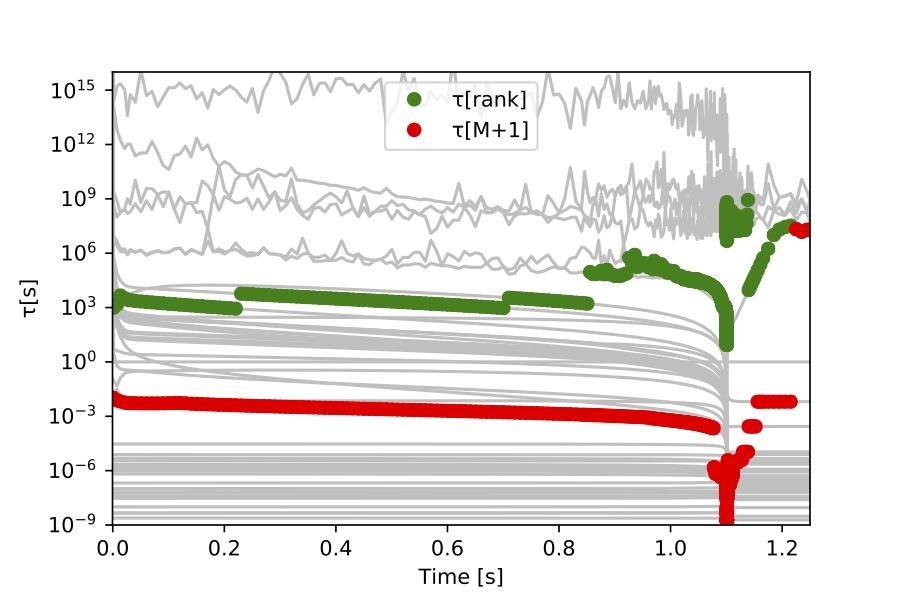
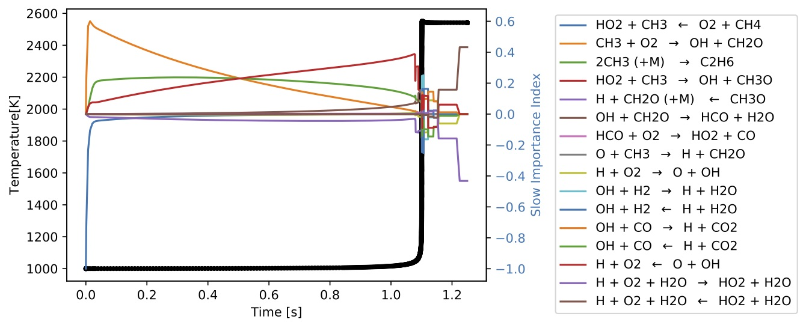
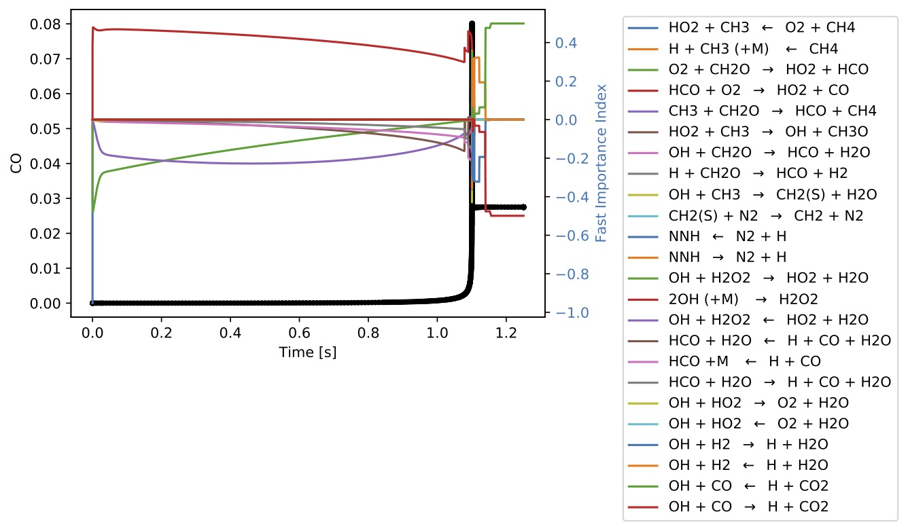

## CSP Analysis For a ODE System Using TChem
The source term, Jacobian, S matrix, and rate of progress (ROP) vector computed by the TChem model class corresponds to a [homogeneous reactor](https://github.com/sandialabs/TChem#homogenousbatchreactors). This reactor consists of one equation for temperature and $N_s$ equations for the species mass fractions.


The source code for this example is at ``CSP_REPOSITORY_PATH/src/example/indexODETChem/run_index_ODE_TChem.cpp``. The executable is installed at ``CSP_INSTALL_PATH/example/index_class/run_index_ODE_TChem.exe``.


The inputs are as follows:

```bash
./run_index_ODE_TChem.exe --help

Usage: ./run_index_ODE_TChem.exe [options]
  options:
  --atol                        double    absolute tolerance for csp analysis e.g., 1e-8
                                          (default: --atol=1.0e-08)
  --chemfile                    string    Chem file name e.g., chem.inp
                                          (default: --chemfile=chem.inp)
  --echo-command-line           bool      Echo the command-line but continue as normal
  --help                        bool      Print this help message
  --inputfile                   string    data base file name e.g., input.dat
                                          (default: --inputfile=input.dat)
  --prefix                      string    prefix to save output files e.g., pos_
                                          (default: --prefix=)
  --rtol                        double    relative tolerance for csp analysis e.g., 1e-2
                                          (default: --rtol=1.0e-02)
  --thermfile                   string    Therm file name e.g., therm.dat
                                          (default: --thermfile=therm.dat)
  --useTChemSolution            bool      Use a solution produced by TChem e.g., true
                                          (default: --useTChemSolution=true)
Description:
  This example carries out a csp analysis with TChem model class

```

 We tested this example with the [gri3.0 reaction mechanism](http://combustion.berkeley.edu/gri-mech/version30/text30.html). We used TChem with the homogenous reaction to produce a database of state vectors. The script to run this example and a jupyter-notebook for post-processing are located at ``CSP_INSTALL_PATH/example/runs/GRI3``.


We use the following bash script to run this example:

 ```bash
 exec=$CSP_INSTALL_PATH/example/index_class/run_index_ODE_TChem.exe
 inputs=data/
 chemfile=$inputs"chem.inp"
 thermfile=$inputs"therm.dat"
 inputfile=$inputs"input.dat"
 useTChemSolution=true
 prefix=csp_output/
 rtol=1e-6
 atol=1e-10
 $exec --useTChemSolution=$useTChemSolution --chemfile=$chemfile --thermfile=$thermfile --inputfile=$inputfile --rtol=$rtol --atol=$atol --prefix=$prefix
 ```

The inputs are:

* the Chemkin file names "chemfile" for the reaction mechanism,
* the  "thermfile" for the thermodynamic data, and
* the database file name "inputfile".


We can use any filename for the input files. In this case, we use ``chem.inp``, ``therm.dat``, and ``input.dat``, and the files are located in the directory ``data``. To use a solution produced by TChem, we set ``useTChemSolution=true`` (Note that we have to run TChem to produce the database).  The ``prefix`` is for the output files, for example, we used ``prefix=csp\_output/``. So, CSPlib will save the output files at the ``csp\_output/`` directory (we need to create this directory). If the ``prefix`` is not specified, CSPlib writes the files in the local directory.   Finally,  we use ``rtol`` and ``atol`` to pass the absolute and relative tolerances for the CSP analysis.   

This example is structured as follows:

```cpp
// create a TChem model instantiation.
// read the database
// compute source therm (rhs), Jacobian, S matrix and rate RoP
// get data from device or host

The TChem class compute the data in a batched mode.

// make a list of file to save data

for (int sp = 0; sp < nSample; sp++) {
 // make an instance of the kernel class

 // compute eigenvalues and eigenvectors

 // sort eigenvalues and eigenvectors

 // set CSP basis vectors

 // compute time scales

 // compute M

 // compute f

// make an instance of the index class

// compute indices   

// save data at each iteration

}

//close files

```

### GRI 3.0 Results

We ran the script presented above, and CSPLib saved the data at ``csp\_output/``.  CSPlib will not write output files. However, in this example, we have collected data to plot results and further analysis.  We recommend using this example as a template. Thus, the users can delete or add data depending on their requirements.

**Model Class**

We create an instantiation of the TChem model with two chemical files, as we described in [section TChem Model Class](#tchemmodelclass):

```cpp
ChemElemODETChem  model(chemFile, thermFile);
```

The example can read a database produced by TChem (``useTChemSolution=true``) or a database produced by another library.    


```cpp
if (useTChemSolution) {
     // read a database from the TChem homogeneous reactor
     std::vector<std::string> var_names;
     model.readIgnitionZeroDDataBaseFromFile(inputFile,var_names);
   } else{
     // read a database that was not produced by TChem
     std::vector<std::vector <double> > state_db_read;
     // Density, pressure, temperature and species mass fraction
     const int numofStateVariables = 3 + model.NumOfSpecies();
     readDataBase(inputFile, state_db_read, numofStateVariables );
     model.setStateVectorDB(state_db_read);
   }
```

The source term, Jacobian, S matrix and RoP for entire database is computed by:

```cpp
//computes RHS
model.evalSourceVector();

//computes jacobian
// O: analytical jacobian. 1: numerical jacobian
model.evalJacMatrix(0);

//compute Smatrix
model.evalSmatrix();

// compute RoP
 model.evalRoP();
```

These computations are done in a batched mode and executed in the CPU or the GPU. To obtain the data from the TChem model class, we use the following functions.

```cpp
// get data from model class to perform CSP analysis  
std::vector< std::vector< double> > state_db;
model.getStateVector(state_db);
```

```cpp
std::vector< std::vector< double> > source_db;
model.getSourceVector(source_db);

std::vector< std::vector< std::vector< double> > > jac_db;
model.getJacMatrix(jac_db);

std::vector< std::vector< double> > RoP_db;
model.getRoP(RoP_db);

std::vector< std::vector< std::vector< double> > > Smatrixdb;
model.getSmatrix(Smatrixdb);
```

Additionally, the TChem model class has functions to obtain auxiliary quantities, such as $N_{\mathrm{var}}$ (ndiff\_var), number of reactions (nReactions) and number of elements(nElem).


```cpp
// get number of variables in the ODE system
auto ndiff_var = model.getNumOfVariables();
const auto nReactions = model.NumOfReactions();
// we split the net RoP in fwd and rev rate
// if a reaction is irreversible one rate is set to zero
const auto nTotalReactions = 2*nReactions;
const int nElem = model.getNumOfElements();
```

**Kernel Class**
The kernel and index classes do not perform batched computations. Thus, we created a for loop to iterate the database. The kernel class is instantiated with the $N_{\mathrm{var}}$, the state vector, source term, and the Jacobian as we described in [section api-kernel](#kernelclass).


```cpp
for (int i = 0; i < nSample; i++) {
     // data from TChem model class
     source = source_db[i];
     state  = state_db[i];
     jac    = jac_db[i];
     Smat   = Smatrixdb[i];
     RoP    = RoP_db[i];

     // instantiation of kernel class
      Kernel ker(ndiff_var, state, source, jac);
     ....

}
```
The kernel class computes the eigensolution, sorts the eigenvalues and eigenvectors, sets the CSP basis vectors, and calculates the mode amplitude. These computations are the core of the CSP analysis.


```cpp
// Eigen solution:
 ker.evalEigenValVec();

 // Sorting eigen values and vectors in ascending order
 ker.sortEigValVec();

// Setting CSP vectors:
ker.setCSPVec(); // A = eig_vec_R and B = A^{-1}

// Compute mode amplitude
ker.evalModalAmp( );
```

The time scales for the ODE system is computed by ``ker.evalTau()`` and the data is obtained by ``ker.getTau(tau_vec)`` for one time step. We saved the time scales at every time step in the file "\_tau.dat".  In this file, the number of elements is  the product of $N_{\mathrm{var}}$ and the number of time steps.


Figure 5. $\tau_{M+1}$ (blue, right y-axis) and temperature (red, left y-axis) versus time, for the GRI3.0 problem.

The number of exhausted modes $M$ is computed by ``ker.evalM(nElem)`` and we obtained the data with `` ker.getM(NofDM)``. $M$ is saved at every time step in the file ``\_m.dat``.  The number of elements in this file  is equal to number of time steps in the database. The time-profile of $M$ is presented in Figure 6. We also plot the gas temperature on the left $y$-axis for reference and easier interpretation of the analysis results.


Figure 6. The number of exhausted modes $M$ (blue, right y-axis) and temperature (red, left y-axis), plotted versus time, for the GRI3.0 problem.


We plot all time scales against time in Figure 7. Note that $\tau_{\mathrm{rank}}$ is the time scale evaluated at the numerical rank of the Jacobian, the numerical rank is saved in the file "\_jac\_numerical\_rank.dat", and it is computed by ``int jac_rank = ker.computeJacobianNumericalRank()``.  We can use the numerical rank to check which eigenvalues are unreliable/invalid. In this case, all the time scales above the green curve are dominated by numerical noise. Therefore, these time scales should not be considered in the analysis.



Figure 7. Time scales versus time for the GRI3.0 problem.

The CSP pointers for all modes were saved in the file "\_cspPointers.dat". The data shows that mode 0 points at $\mathrm{NNH}$, as shown in Figure 8. We produce this file with functions:``ker.evalCSPPointers()`` and``ker.getCSPPointers( cspp_ij )`` as we describe in [api-kernel section](##kernelclass). The amplitude of modes can have negative or positive values. In this figure, we plot the absolute value of the amplitude of mode 0. The absolute amplitude is close to zero in the whole database except near the ignition point. The matrix produced by the ``ker.getCSPPointers( cspp_ij )`` has a size of $N_{\mathrm{var}} \times N_{\mathrm{var}}$, we saved this matrix in the file for each time step, thus the size of this file is the number of time steps times $N_{\mathrm{var}} \times N_{\mathrm{var}}$.  We load this data in the jupyter-notebook and reshape this matrix to further analysis.


```python
Pointers = np.loadtxt(firstname +"_cspPointers.dat")
Ptrs = np.reshape(Pointers,[NtimeStep,Nvar,Nvar])
```

To find the element position of the variables that each mode points to, we used the python function ``getTopIndex``, which is in the ``CSP_INSTALL_PATH/example/runs/scripts/CSPindexHelper.py`` script.


Figure 8. CSP pointers for mode 0 (right y-axis) and absolute amplitude of mode 0 versus time (left y-axis), for the GRI3.0 problem. Mode 0 points at $\mathrm{NNH}$. The time axis includes a short time-interval around the ignition time.

We can compute the CSP pointers for a given mode using the function ``ker.evalAndGetCSPPointers(cspp_k)`` as we described in [api-kernel section](##kernelclass). In this example, we save the CSP pointer data to the  file ``\_Mode0\_cspPointers.dat`` for the mode 0.

**Index Class**

We instantiate the index class with inputs from the TChem model class (nTotalReactions, ndiff\_var, Smat, RoP) and from the kernel class NofDM,  eig\_val\_real, eig\_val\_imag, csp\_vec\_R\_2d, csp\_vec\_L\_2d) as described in [api-index section](##indexclass).  


```cpp
// instantiate CSP Index class
 CSPIndex idx(nTotalReactions, ndiff_var,
                   NofDM, eig_val_real, eig_val_imag,
                   csp_vec_R_2d, csp_vec_L_2d, Smat, RoP );
```

We implemented two alternatives to compute the CSP indices. In the first approach, we calculate the index for all variables/modes, and in the second approach, we only calculate one variable/mode.  


***First Approach***:
An example use of the first approach is as in the following.

```cpp
//First approach indices for all variable and mode are compute by
//eval index class data
CSPIndex::evalParticipationIndex();
CSPIndex::evalImportanceIndexSlow();
CSPIndex::evalImportanceIndexFast();

//get data
idx.getParticipationIndex ( P_ik     );
idx.getImportanceIndexSlow( Islow_jk );
idx.getImportanceIndexFast( Ifast_jk );
```
This last set of functions return the Participation and Importance indices. We  save these results in the files ``_SlowImportanceIndex.dat`` for the slow Importance index ([Eq. 9](#indexclass)), ``_FastImportanceIndex.dat`` for the fast Importance index ([Eq. 10](#indexclass)), and ``_ParticipationIndex.dat`` for the Participation index ([Eq. 11](#indexclass)). These files can be easily read by a python/numpy script, for example:


```python
Slowind = np.loadtxt(firstname +"_SlowImportanceIndex.dat")
St = np.reshape(Slowind,[NtimeStep,Nvar,NtotalReactions])

Fastind = np.loadtxt(firstname +"_FastImportanceIndex.dat")
Ft = np.reshape(Fastind,[NtimeStep,Nvar,NtotalReactions])

PIind = np.loadtxt(firstname +"_ParticipationIndex.dat")
Pt = np.reshape(PIind,[NtimeStep,Nvar,NtotalReactions])
```

We plotted the slow/fast Importance indices for temperature and $\mathrm{CO}$ in Figures (9)-(12). The list of reactions in these figures corresponds to the reactions with indices having the first and second highest absolute value. Additionally, we only selected values higher than 1e-2. To obtain these lists of reactions (reaction number in the RoP vector), we used the python function ``getTopIndex``, which is in the ``CSP_INSTALL_PATH/example/runs/scripts/CSPindexHelper.py`` script. We could produce similar plots for all variables for the fast/slow importance indices.


Figure 9. Temperature (black, left y-axis), and the Slow importance indices for temperature (right y-axis), versus time, for the GRI3.0 problem. List of reactions corresponds to the top two reactions for each iteration and with index (absolute value) bigger than threshold=1e-2.  


Figure 10.  Mass fraction of $\mathrm{CO}$ (black, left y-axis), and the Slow importance indices for $\mathrm{CO}$ (right y-axis), versus time, for the GRI3.0 problem. List of reactions corresponds to the top two reactions for each iteration and with index (absolute value) bigger than threshold=1e-2.  


Figure 11.  Temperature (black, left y-axis), and the Fast importance indices for temperature (right y-axis), versus time, for the GRI3.0 problem. List of reactions corresponds to the top two reactions for each iteration and with index (absolute value) bigger than threshold=1e-2.    



Figure 12.  Mass fraction of $\mathrm{CO}$ (left y-axis), and the Fast importance indices for $\mathrm{CO}$ (right y-axis), versus time, for the GRI3.0 problem. List of reactions corresponds to the top two reactions for each iteration and with index (absolute value) bigger than threshold=1e-2.

We plotted the Participation index of mode 0 in Figure 13. Note that $\mathrm{NNH}$ is involved in three reactions that have a high value of the participation index for mode 0, which is consistent with the CSP pointers for mode 0 that also pointed at this species (see above).


Figure 13. Participation index for mode 0 (right y-axis), and amplitude of mode 0 (left y-axis), versus time, for the GRI3.0 problem. List of reactions corresponds to the top two reactions for each iteration and with index (absolute value) bigger than threshold=1e-2. Both axes are in absolute value.


As we can see in Figures~(9)--(12), the values of Participation and fast/slow Importance indices are in [-1,1] range. The sum over a point in time in these figure is not always one because we only plot the top reactions. However, the sum over indices of all reactions in absolute value is one. Note that, while the source term and Jacobian of the ODE system evolve smoothly in time, the analysis is always local at each instant in time. Since the eigenvectors are indeterminate up to multiplication by a ($\pm$) constant, and, further, given the step-wise variation of the integer $M$, the various indices can exhibit step changes as seen in these plots.    


Figure 14. Temperature (black, left y-axis), and absolute value of slow importance index for temperature (right y-axis), versus time, for the GRI3.0 problem. The list of reactions corresponds to the top two reactions for each iteration and with index (absolute value) larger than 1e-2. Zoom in around ignition point.


***Second Approach***:

There are cases where we only want to obtain CSP analysis results for a specific variable. Thus, we do not want to compute indices for the whole set of variables, only the variables of interest. To do this, we can use the following functions(see [api-index](#indexclass) section):


```cpp
/* eval and get participation index for one mode*/
int modeIndx(0);
idx.evalAndGetParticipationIndex(modeIndx, P_k);

/* eval and get slow importance index for one variable */
idx.evalAndGetImportanceIndexSlow(indxCH4, Islow_k_ch4);

/* eval and get fast importance index for one variable */
idx.evalAndGetImportanceIndexFast(indxCH4, Ifast_k_ch4);
```

In the above functions, we only computed the Participation index of mode 0, and the slow/fast Importance indices of $\mathrm
{CH_4}$. We obtained the species index of the $\mathrm {CH_4}$ variable in the state vector using ``ChemElemODETChem::getVarIndex(var_name)``. We saved the above indices for all iterations in the files: "\_Mode0\_ParticipationIndex.dat" for the participation index of mode 0, "\_CH4\_FastImportanceIndex.dat"  and "\_CH4\_SlowImportanceIndex.dat" for the slow and Importance indices of $\mathrm{CH_4}$ species. Further, we obtained the top reactions with the function ``CSPIndex::getTopIndex`` described in [api-index](#indexclass) section.


```cpp
example for CH4 and mode 0
/* get top rate of progess */
idx.getTopIndex(P_k, Top_rop, threshold_rop,  IndxListPart );
idx.getTopIndex(Islow_k_ch4, Top_rop, threshold_rop,  IndxListch4 );
idx.getTopIndex(Ifast_k_ch4, Top_rop, threshold_rop,  IndxListFastch4 );
```
The function ``CSPIndex::getTopIndex`` produces a "std::vector<int>"" with the reaction number for reactions that are in the top values(in this case top\_rop=2) and with a CSP index with absolute value bigger than 1e-2 (threshold\_rop=1e-2). We saved these "std::vector<int>" in the files: ``\_Mode0\_ParticipationIndexTopElemPosition.dat`` for the participation index of mode 0, ``\_CH4\_FastImportanceIndexTopElemPosition.dat`` for the fast Importance index of $\mathrm{CH_4}$, ``\_CH4\_SlowImportanceIndexTopElemPosition.dat`` for the slow Importance index of  $\mathrm{CH_4}$.
With these files, the plots in Figures~(15,16) are produced.


Figure 15. Mass fraction of $\mathrm{CH_4}$ (black, left y-axis), and absolute value of the slow importance index for $\mathrm{CH_4}$ (right y-axis), versus time, for the GRI3.0 problem. The list of reactions corresponds to the top two reactions for each iteration and with index (absolute value) larger than 1e-2.  


Figure 16. Mas fraction of CH$_4$ (black, left y-axis), and the absolute value of the fast importance index for $\mathrm{CH_4}$ (right y-axis), versus time, for the GRI3.0 problem. The list of reactions corresponds to the top two reactions for each iteration and with index (absolute value) larger than 1e-2   

### CSP Analysis Using the Tines EigenSolver

CSPlib has an interface for the Tines eigensolver for GPU computation (see [section](#eigensolverwithtines)). We create an example using this solver and the source code is at ``CSP_REPOSITORY_PATH/src/example/indexODETChem/run_index_ODE_TChem_K.cpp``. The executable is installed at ``CSP_INSTALL_PATH/example/index_class/run_index_ODE_TChem_K.exe``. This example is the same as the above example for ODE except for the computation of eigenvalues and eigenvectors.


To call the Tines eigensolver:
```cpp
std::vector< std::vector< double> >  eig_val_real_bath;
std::vector< std::vector< double> >  eig_val_imag_bath;
std::vector< std::vector< std::vector< double> > > eig_vec_R_bath;

EigenSolver::evalDevice(model._jac,
                        eig_val_real_bath,
                        eig_val_imag_bath,
                        eig_vec_R_bath);
```
The ``model._jac`` is a public attribute of the TChem model class. This attribute is allocated on the device memory space and represents the Jacobians for the whole database. The outputs of this function are the real and imaginary parts of the eigenvalues and the right eigenvectors.

With the eigenvalues and eigenvector, we loop over the whole database:

```cpp
for (int i = 0; i < nSample; i++) {
  eig_val_real = eig_val_real_bath[i];
  eig_val_imag = eig_val_imag_bath[i];
  eig_vec_R_2D = eig_vec_R_bath[i];

  // convert 2D to 1D
  int count=0;
  for (size_t k=0; k<ndiff_var; k++) {
    for (size_t j=0; j<ndiff_var; j++) {
      eig_vec_R[count] = eig_vec_R_2D[k][j];
      count++;
    }
  }

  ker.setEigenValVec(eig_val_real, eig_val_imag, eig_vec_R);
  // Sorting eigen values and vectors in ascending order
  // of, sign(eig_val_real)*Mod(eig_val_real + i * eig_val_imag)
  ker.sortEigValVec();

  ...

}
```

We pass the eigensolution to the kernel class with the function ``ker.setEigenValVec``, and then we sort the eigensolution.

The outputs of this example are the same as the above example. However, there are small differences between the results because of discrepancies between the smallest eigenvalues computed by Lapack and the Tines solver.
