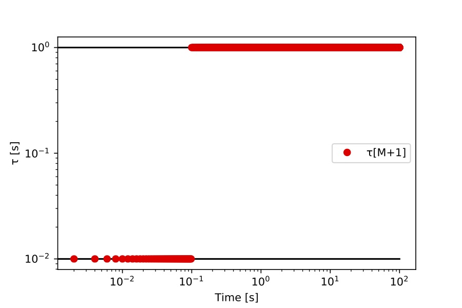
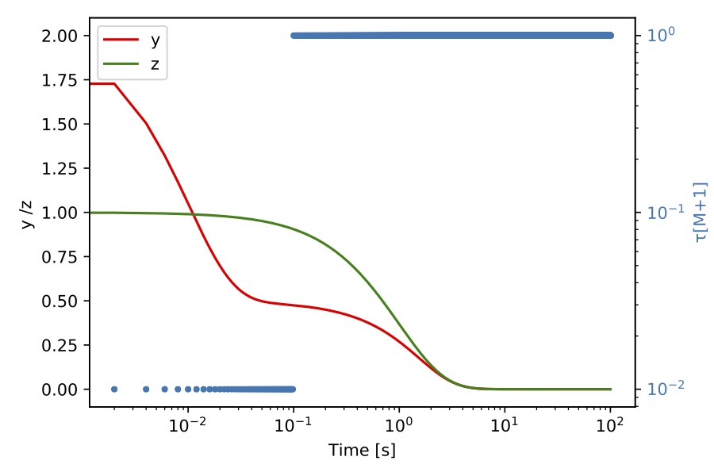
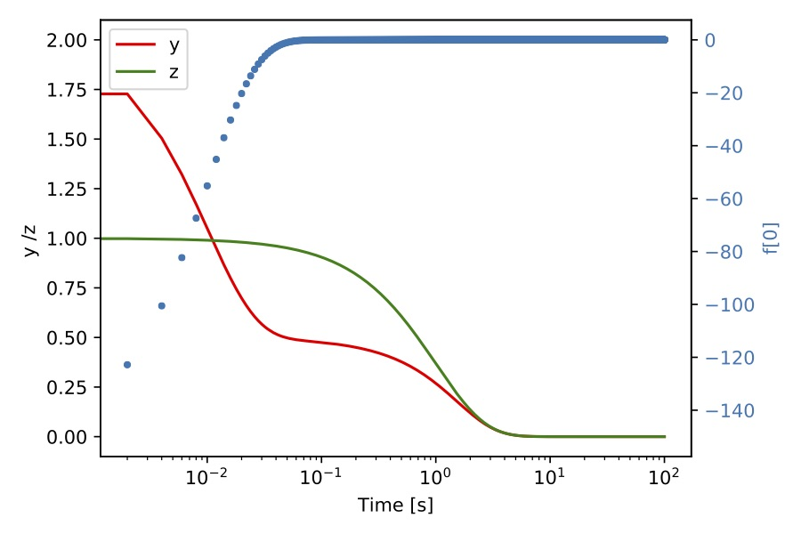
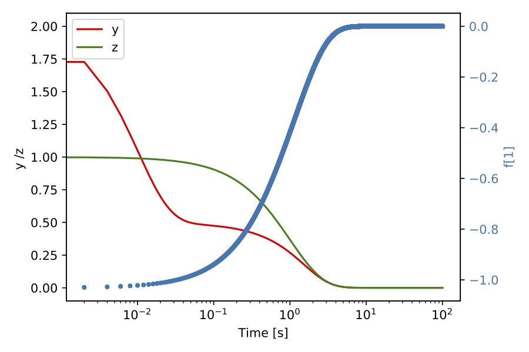

## CSP Analysis For The Davis Skodje Problem Using The General ODE Class

We use the gODE class (``CSP_REPOSITORY_PATH/src/core/gODE.cpp``) to analyze the Davis-Skodje (DS) problem [Davis-Skodje 1999](https://aip.scitation.org/doi/10.1063/1.479372), [Valorani 2005](https://www.sciencedirect.com/science/article/pii/S0021999105001981) to illustrate the utility of CSPlib in analyzing stiff ODE systems.

This is a two dimensional ODE system,

$$ \frac{dy}{dt} =\frac{1}{\epsilon}\Big( -y + \frac{z}{1 + z } \Big)- \frac{z}{(1 + z)^2}
$$

$$
\frac{dz}{dt}=-z
$$

With the initial condition $y(0)=y_o$, $z(0)=z_0$. Where the $\epsilon$ parameter is constant and much smaller than one. In this system, $z$ is the slow variable and $y$ is the fast variable. The analytical solution of this problem is:

$$
y(t)=\Big(y_0 - \frac{z_0}{1 + z_0} \Big) e^{-t/\epsilon} + \frac{z_0 e^{-t}}{1 + z_0e^{-t}}
$$

$$
z(t)=z_0e^{-t}
$$

The example code for this problem is in ``CSP_REPOSITORY_PATH/src/example/gODE/driver_gODE_Davis_Skodje.cpp``.

Usage information is available:  

```bash
./driver_gODE_Davis_Skodje --help
Usage: ./driver_gODE_Davis_Skodje [options]
  options:
  --atol                        double    absolute tolerance for csp analysis e.g., 1e-8
                                          (default: --atol=1.0e-14)
  --echo-command-line           bool      Echo the command-line but continue as normal
  --help                        bool      Print this help message
  --nPoints                     int       number of points  e.g., 2000
                                          (default: --nPoints=2000)
  --rtol                        double    relative tolerance for csp analysis e.g., 1e-2
                                          (default: --rtol=1.0e-03)
  --tend                        double    time end e.g., 4
                                          (default: --tend=4.0e+00)
  --y0                          double    initial value for y e.g., 2
                                          (default: --y0=2.0)
  --z0                          double    initial value for y e.g., 1e-2
                                          (default: --z0=1.0e-02)
Description:
  This example Number of exhausted and time scale for mDavis Skodje problem
```

The following bash script runs a CSP analysis for the DS problem:

```bash
exec=$CSP_INSTALL_PATH/example/kernel_class/driver_gODE_Davis_Skodje
rtol=1e-4
atol=1e-14
y0=2.
z0=1.
tend=15.
nPoints=10000
$exec --tend=$tend --y0=$y0 --nPoints=$nPoints --z0=$z0 --rtol=$rtol --atol=$atol
```
 The above script and a jupyter-notebook with the below figures is located at ``CSP_INSTALL_PATH/example/runs/Davis_Skodje``.


 The inputs from the script are:
  * the executable for this example ("driver\_gODE\_Davis\_Skodje"),
  * the relative and absolute tolerances for csp analysis ("rtol" and "atol"),
  * the initial condition for the problem "y0" and "z0",
  * the final time "tend" and the number of points that we want to produce for the analysis "nPoints".


The example has the following structure:

 ```cpp
 //set the GeneralODE with the mDavis_Skodje rhs and jacobian

 // make a list of file to save data

//for example
 std::string mNew_file_name = firstname + "_m.dat";
 FILE *fout = fopen ( (mNew_file_name).c_str(), "w" );


 // make a for loop over the nPoints

 for (int sp = 0; sp < nPoints; sp++) {

  // set state vector: from analytical solution

  // compute source terms and Jacobian

  // make an instance of the kernel class

  // compute eigenvalues and eigenvectors

  // set CSP basis vector

  // sort eigenvalues and eigenvectors

  // compute time scales

  // compute modal amplitude

  // compute M

 }  

 fclose(fout)
 ```
We save data for each time iteration (nPoints), the data correspond to: the number of exhausted modes $M$ ``_m.dat`` (nPoints), the time scales ($2 \times $ nPoints ) ``_tau.dat``, the numerical rank of the Jacobian ($2 \times 2 \times$ nPoints) ``_jac_numerical_rank.dat``, the amplitude of the modes ``_magMode.dat`` ($2 \times $nPoints), the state vector ``_state.dat`` ($2 \times $nPoints ) and time (``_time.dat``).  With these data we produce the following figures:


Figure 1. A plot of time scales versus time. Red dots correspond to $\tau_{M+1}$, the time scale of the fastest active mode.


Figure 2. A plot of $(y,z)$ (left axis) and $M$ (right axis) versus time for the DS problem.   


Figure 3.  A plot of $(y,z)$ (left axis) and $\tau_{M+1}$ (right axis) versus time for the DS problem.


Figure 4. A plot of $(y,z)$ (left axis) and $f^0$ (right axis) versus time for the DS problem.


Figure 5. A plot of $(y,z)$ (left axis) and $f^1$ (right axis) versus time for the DS problem.

The CSP analysis reveals characteristics of the DS problem that could not identify from its source term equation. The analysis shows a fast and a slow time scale (see Figure1 ), where the slow time scale is $1e-2$ s, and the fast time scale is $1$ s. From Figure 2, we can notice that between time $0$ s to $1e-1$ s, there are zero exhausted modes ($M$). In this time interval, $\tau_{M+1}$ is equal to the slow time scale (Figure 1), which means the process advance at the slow time scale because all processes are active.  Between  $1e-1$ s and $30 $ s, $M$ changes to 1, in this time interval $\tau_{M+1}$ also changes to the fast time scale. At the end of this period, both curves become constant, $M$ is 2, denoting that the system is in equilibrium. Similarly, the mode amplitude curves in the Figures 4 and 5 display the behavior describe above. The mode amplitude $f_0$ reaches equilibrium at  $1e-1$ s and the mode amplitude $f_1$ reaches equilibrium at $30 $ s $M$.

### CSP Analysis Using TINES GPU EigenSolver

The computation of the eigenvalues and eigenvectors is one of the most computational expensive parts of the CSP analysis. Thus, CSPlib offers an interface for the [Tines GPU eigensolver](#eigensolverwithtines). We use this interface to compute the eigensolution for DS problem.  The example code is in: ``CSP_REPOSITORY_PATH/src/example/gODE/driver_gODE_Davis_Skodje_K.cpp``.

The structure of this example with Tines' eigensolver is:  

```cpp
CSP::ScopeGuard guard(argc, argv);

//set the GeneralODE with the mDavis_Skodje rhs and Jacobian

// make a list of file to save data

//for example
std::string mNew_file_name = firstname + "_m.dat";
FILE *fout = fopen ( (mNew_file_name).c_str(), "w" );


// make a for loop over the nPoints

for (int sp = 0; sp < nPoints; sp++) {

 // set state vector: from analytical solution

 // compute source terms and Jacobian

}

 // compute eigenvalues and eigenvectors using the TINES GPU EigenSolver

 EigenSolver::evalDevice(jac_db,
                         eig_val_real_bath,
                         eig_val_imag_bath,
                         eig_vec_R_bath);

for (int sp = 0; sp < nPoints; sp++) {

 // make an instance of the kernel class

 // set eigenvalues and eigenvectors

 // sort eigenvalues and eigenvectors

 // set csp basis vector

 // compute time scales

 // compute modal amplitude

 // compute M

}  

fclose(fout)
```

We need to add "ScopeGuard" at the top of the code. This scope guard initializes Kokkos when the program begins and also finalizes Kokkos when the program ends. The ScopeGuard is a simple struct:

```cpp
struct ScopeGuard {
    ScopeGuard(int argc, char** argv) { Kokkos::initialize(argc, argv); }
    ~ScopeGuard() { Kokkos::finalize(); }
  };
```

We split the loop over the whole database into three parts. In the first part, we compute the source and Jacobians, and we store it in 3D std vectors. In the second part, we pass the Jacobians to the Tines' eigensolver.

```cpp
EigenSolver::evalDevice(jac_db,
                        eig_val_real_bath,
                        eig_val_imag_bath,
                        eig_vec_R_bath);
```
Finally, in the third part, we feed the eigenvalues and eigenvectors into the kernel class using the function ``ker.setEigenValVec``, and then we compute the CSP data.

```cpp
ker.setEigenValVec(eig_val_real, eig_val_imag, eig_vec_R);
// Sorting eigen values and vectors
// of, sign(eig_val_real)*Mod(eig_val_real + i * eig_val_imag)
ker.sortEigValVec();
```

The results of this example are exactly the same to the DS example presented above.  
